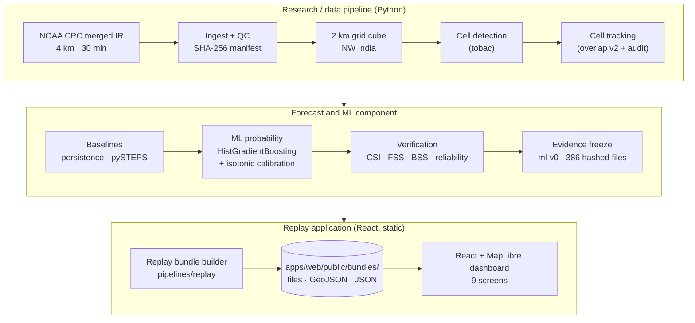

# StormLife Nowcast

**A satellite-first, replay-only research prototype for 0–6 h convective-storm nowcasting: from infrared imagery to tracked storm cells to calibrated, verifiable forecasts.**

**SIH26084** | Disaster Management | Software
**Team:** THE FEVICONS · **Team ID:** 167858

> **Status: research prototype, replay only.** It replays saved results for real past storm days. It is **not** live or operational, it is **not** an official IMD warning, and it does **not** forecast hail, lightning, rainfall, downburst velocity or cloudburst thresholds. What it forecasts is *deep-convective cloud* (cloud-top brightness temperature < 235 K). See [Limitations](#11-limitations-and-what-we-do-not-claim).

---

## Contents
1. [Problem statement](#1-problem-statement)
2. [Our solution](#2-our-solution)
3. [What makes the prototype useful](#3-what-makes-the-prototype-useful)
4. [System architecture](#4-system-architecture)
5. [Technology stack](#5-technology-stack)
6. [Data sources](#6-data-sources)
7. [Results](#7-results-frozen-evidence-ml-v0)
8. [The web prototype](#8-the-web-prototype)
9. [Getting started](#9-getting-started)
10. [Reproducibility and evidence](#10-reproducibility-and-evidence)
11. [Limitations and what we do not claim](#11-limitations-and-what-we-do-not-claim)
12. [Repository structure](#12-repository-structure)
13. [Documentation index](#13-documentation-index)

---

## 1. Problem statement

**SIH26084 — "Convective scale nowcasting for Thunderstorms, Hail & Cloudbursts (0–6 hr)"** (Software / Disaster Management).

Severe convective storms (thunderstorms, lightning, hail, downburst winds and cloudbursts) are among India's most dangerous weather hazards, especially before and during the monsoon. They develop within minutes and at scales that coarse numerical weather prediction grids can miss. The problem statement asks for:

- a convective-scale nowcasting system with **0–6 h lead time** at about **1–3 km** resolution;
- ingestion of high-frequency, heterogeneous streams (Doppler radar, geostationary satellite imagery, lightning networks) in a multi-source data-fusion design;
- early detection of convective initiation and forecasts of severe-storm parameters (lightning, hail probability, downburst velocity, cloudburst thresholds);
- an interactive **GIS-mapped dashboard** of hazard zones for decision support.

Source: [SIH26084_Research_Report.md](SIH26084_Research_Report.md) §1 and [docs/PRD.md](docs/PRD.md).

**What we could actually access.** Radar volumes and lightning networks are restricted, and INSAT/Meteosat access needs accounts we did not use ([docs/DATA_REALITY.md](docs/DATA_REALITY.md)). The prototype therefore takes the open, satellite-only route and is explicit about the resulting scope.

## 2. Our solution

**StormLife Nowcast is satellite-first storm-lifecycle intelligence.** It reads a geostationary infrared image sequence, finds the cold cloud tops that mark deep convection, follows them through time, forecasts where they will be, and attaches a calibrated probability, then shows the forecast next to what actually happened.

```
Satellite IR → Quality control → Storm-cell detection → Cell tracking
     → Motion / advection forecast → Calibrated ML probability
     → Validation → Replay / decision-support dashboard
```

| Stage | What the repository actually does |
|---|---|
| Satellite IR + QC | Downloads NOAA/NCEP/CPC merged IR with resume and SHA-256 manifest; decodes brightness temperature; flags missing/out-of-range values and fills only short gaps (flagged). |
| Common grid | Regrids to a 2 km grid over NW India (26–34° N, 72–84° E). |
| Detection | Segments cold cloud objects (tobac). |
| Tracking | Links cells across frames with an overlap-based v2 tracker, audited against v1. |
| Forecast | Persistence, pySTEPS motion extrapolation (Lucas–Kanade + semi-Lagrangian) at 30–360 min, and a neighbourhood-probability version of pySTEPS. |
| ML probability | Gradient-boosted model with isotonic calibration: P(cloud-top BT < 235 K) per pixel and lead. |
| Validation | CSI, POD, FAR, bias, FSS, Brier skill score, reliability, block bootstrap, on held-out storm days. |
| Replay | A static replay bundle per event, shown in a 9-screen web dashboard. |

**Today it can:** replay three real held-out storm days (E8 14 May, E10 4 May, E11 16 May 2026), show detected/tracked cells, pySTEPS and ML forecasts up to 6 h ("what the system knew / what it predicted / what actually happened"), display frozen scorecards, and draft **exercise-only** CAP 1.2 advisories.

## 3. What makes the prototype useful

Each point is backed by a file in this repository:

- **Baseline-first forecasting.** Every ML claim is measured against persistence, pySTEPS and a no-fit neighbourhood pySTEPS on identical pixels ([docs/BASELINE_EVAL.md](docs/BASELINE_EVAL.md), [docs/ML_PROTOTYPE.md](docs/ML_PROTOTYPE.md)).
- **Calibrated probability.** Isotonic calibration per lead bin; calibration error 0.002–0.004 on held-out days ([docs/FINAL_CLAIMS.md](docs/FINAL_CLAIMS.md) A7).
- **Audited storm tracking.** The v1 tracker failed its own audit (ID-switch candidates 20.6 %); the overlap tracker cut them to 0.4 % ([docs/TRACKING_AUDIT.md](docs/TRACKING_AUDIT.md)). Object-level claims stay diagnostic and go no further than 30 min.
- **Real-event replay.** Nothing is simulated: every screen reads saved outputs of real satellite data.
- **Held-out storm-day validation.** Train, validation and test are split by calendar day; event days ±1 day are never used for fitting; test days were scored once with the frozen model.
- **Traceable evidence.** Raw files carry SHA-256 hashes; 386 result files are hashed in [docs/FREEZE_ml-v0.json](docs/FREEZE_ml-v0.json) and guarded by a test.
- **Visible uncertainty and limitations.** Negative results are reported next to positive ones (e.g. ML does not beat pySTEPS as a yes/no forecast beyond 1 h). The dashboard shows REPLAY status, data availability, and a claim guard.
- **Reproducible pipeline.** Pinned environment, configs under `config/`, tests for each phase.

## 4. System architecture

There is **no backend, database or cloud service**. The research pipeline is Python, run offline; it writes static files that a browser app reads.



More diagrams (layered architecture, data/ML pipeline, replay workflow, dashboard information architecture): [docs/DIAGRAMS.md](docs/DIAGRAMS.md). Design documents: [docs/ARCHITECTURE.md](docs/ARCHITECTURE.md), [docs/REPLAY_SPEC.md](docs/REPLAY_SPEC.md).

## 5. Technology stack

Versions are pinned in [requirements.txt](requirements.txt) and [apps/web/package.json](apps/web/package.json).

**Data and scientific computing:** Python 3.11 · NumPy · pandas · xarray (with netCDF4) · SciPy · pyproj · PyArrow (Parquet) · Matplotlib · Pillow · PyYAML · requests

**Storm intelligence:** tobac (cell segmentation) · trackpy and numba (tobac dependencies) · scikit-image · an in-repo overlap-based tracker and lifecycle diagnostics (`ml/tracking/`) · OpenCV (headless; used by pySTEPS for Lucas–Kanade optical flow)

**Forecast and validation:** pySTEPS 1.21.5 (advection nowcast) · scikit-learn (HistGradientBoosting, isotonic regression) · joblib · in-repo verification scores (`ml/verification/`) · pytest

**Frontend:** React 18 · TypeScript 5 · Vite 5 · MapLibre GL 4 · Vitest (unit tests) · Playwright (end-to-end tests)

Named in early planning documents but **not used**: SatPy, rasterio, MetPy, Tailwind, deck.gl, LightGBM (replaced by scikit-learn), FastAPI, PostGIS, Docker, deep learning.

## 6. Data sources

| Source | Role |
|---|---|
| **NOAA/NCEP/CPC Globally Merged IR** (`ftp.cpc.ncep.noaa.gov/precip/global_full_res_IR/`) | The only forecasting and verification data: ~11 µm brightness temperature, ~4 km, 30-minute cadence, anonymous HTTPS. |
| **IMD RMC New Delhi hail-storm report (public PDF)** | Used **only to select event days** and to label reported places on the map. It is archived in `data/raw/hail_reports/` with a SHA-256 hash. It is *not* used as forecast truth. |
| **OpenStreetMap Nominatim** | Geocoding the place names printed in that report (≤ 1 request/s). |

**Period and events.** The archive on the server starts on 1 May 2026, so the prototype uses May 2026 only: 600 hourly files covering 25 days. Held-out test events are **E8 (14 May)**, **E10 (4 May)** and **E11 (16 May 2026)**. The 1 May event (E8a) was excluded by a rule fixed beforehand (too little cold cloud). Model training uses 18–31 May and validation 6–12 May.

**Why this dataset.** It is openly downloadable with no account and is continuous over the whole domain. INSAT (MOSDAC) and Meteosat (EUMETSAT) need accounts we did not use, and no radar or lightning data was used. The NOAA product substitutes for them; what it cannot show is listed in [Limitations](#11-limitations-and-what-we-do-not-claim).

Every downloaded file, with URL, size, timestamp and SHA-256, is recorded in [data/raw/cpc_merged_ir/manifest.json](data/raw/cpc_merged_ir/manifest.json) and summarised in [data/PROVENANCE.md](data/PROVENANCE.md).

## 7. Results (frozen evidence, `ml-v0`)

All numbers come from three held-out event days pooled and are traceable in [docs/FINAL_CLAIMS.md](docs/FINAL_CLAIMS.md) and [docs/FINAL_RESULTS.md](docs/FINAL_RESULTS.md).

**Probability skill** (Brier skill score vs training climatology; higher is better, 0 = no skill):

| Lead | Persistence | pySTEPS | Neighbourhood pySTEPS | **ML (ml-v0)** |
|---|---|---|---|---|
| 30 min | 0.32 | 0.44 | 0.63 | **0.67** |
| 1 h | −0.04 | 0.10 | 0.41 | **0.51** |
| 2 h | −0.47 | −0.38 | 0.02 | **0.27** |
| 3 h | −0.69 | −0.67 | −0.23 | **0.13** |
| 4 h | −0.78 | −0.82 | −0.37 | **0.06** |
| 6 h | −0.84 | −1.11 | −0.59 | −0.03 |

**Reading it honestly:**
- pySTEPS beats persistence at every lead on all 3 days; useful extrapolation skill ends at about 2 h.
- The calibrated ML probability is best in probability skill up to about 4 h; it has no skill at 6 h.
- As a **yes/no forecast** (p ≥ 0.5), ML does **not** beat pySTEPS beyond 1 h, and it is mostly a calibrated neighbourhood smoothing of pySTEPS. Storm-initiation skill is not demonstrated.
- The 95 % bootstrap gain over the neighbourhood reference is significant within E8 and E10, not on the weak E11 day. Three events cannot support significance across events.

## 8. The web prototype

A static React + TypeScript + MapLibre app that replays the frozen evidence. It computes no metric itself.

| # | Screen | Shows |
|---|---|---|
| 1 | Event selection | E1–E11 with honest availability (bundled / excluded / not available, with reason) |
| 2 | Situation | Observed IR, detected cells, motion arrows, reported places, KPIs |
| 3 | Storm cells | Cell track, lifecycle diagnostics, ML probability near the forecast position |
| 4 | 0–6 h forecast | Persistence / pySTEPS / ML at 30 min–6 h, with the frozen skill ribbon |
| 5 | Alert center | Draft advisories, approve/reject, CAP 1.2 preview with `status=Exercise` |
| 6 | Historical replay | Three synced panes: what the system knew / predicted / what happened |
| 7 | Confidence | Reliability diagrams, bootstrap intervals |
| 8 | Model performance | Baselines vs ML, claim guard |
| 9 | Data health | Source status, per-frame QC, hashes, limitations |

The map basemap uses online Esri tiles and can be switched off; all data layers are local. Walkthrough: [docs/PRODUCT_DEMO.md](docs/PRODUCT_DEMO.md).

## 9. Getting started

Requires Python 3.11 and Node.js ≥ 18. All commands run from the repository root.

**Install**
```bash
python3.11 -m venv .venv
.venv/bin/pip install -r requirements.txt   # pySTEPS may need a source build; see the note in requirements.txt
cd apps/web && npm ci && cd ../..
```

**Run the web demo (replay)**
```bash
# Only if apps/web/public/bundles/ is missing: rebuild the replay bundles from the frozen outputs
.venv/bin/python -m pipelines.replay.build_bundle --event E8_20260514 E10_20260504 E11_20260516

cd apps/web
npm run build && npm run preview      # http://localhost:4173/  (or: npm run dev)
```
**Deploy the frontend (Vercel, static):** Root Directory `apps/web`, Framework Vite, Install `npm ci`, Build `npm run build`, Output `dist`; no environment variables. Settings are pinned in `apps/web/vercel.json`. The app has no router and no backend; replay bundles are served as static files from `apps/web/public/bundles/`.

Open **E8 · 14 May 2026** first. E10 and E11 also open; other events are greyed with a reason.

**Run the tests**
```bash
.venv/bin/python -m pytest -q                                  # Python suite incl. the evidence-freeze guard
cd apps/web && npm test                                        # unit tests
cd apps/web && npx playwright install chromium && npm run e2e  # end-to-end demo flow
```
Last verified locally: 76 passed / 1 skipped (Python), 6/6 unit tests, 2/2 end-to-end tests, type-check and production build pass.

## 10. Reproducibility and evidence

- **Raw data:** re-downloadable from NOAA CPC; URLs and SHA-256 in the manifest.
  ```bash
  .venv/bin/python -m pipelines.ingest.cpc_merged_ir --start 2026-05-14T00:00 --end 2026-05-14T23:00
  ```
- **Per-event pipeline** (cube → tracking → baselines → audit): `bash scripts/run_event_pipeline.sh <EVENT>`. ML dataset, training and evaluation: `scripts/build_ml_dataset.py`, `scripts/train_ml.py`, `scripts/evaluate_ml.py`. Settings live in `config/`.
- **Frozen evidence:** [docs/FREEZE_ml-v0.json](docs/FREEZE_ml-v0.json) hashes 386 files; `tests/test_phase7_freeze.py` fails if any frozen file changes or is missing.
- **Large data is not stored in git.** `data/raw/` (~16 GB), `data/interim/` (~0.6 GB) and `data/processed/` (~1 GB) are git-ignored. The freeze test and bundle rebuild need them locally. The storage decision (Git LFS, external archive, or re-download) is still open. The committed replay bundles (~75 MB) are enough to run the demo.
- **Small, committed evidence:** `data/models/ml-v0/` (model and model card), `data/figures/`, `data/PROVENANCE.md`.

## 11. Limitations and what we do not claim

**Limitations**
- Only **3 held-out storm days**, all May 2026, NW India. No claim beyond them, and no cross-event significance.
- **Backward-in-time test:** the archive begins on 1 May, so training days (18–31 May) come after the test days. Thin training data: 14 days, 7 convective.
- **30-minute cadence, single IR channel**; no radar or lightning validation. Truth is the same satellite field, so tracking accuracy is unvalidated.
- Parallax is not corrected; the satellite-ID code is unverified; pySTEPS is built locally without OpenMP; scikit-learn's HistGradientBoosting replaced LightGBM.
- The prototype is a **replay**: no live feed, latency is not modelled.

**We do not claim:** 6-h skill · hail, lightning, rainfall, downburst or cloudburst forecasts · storm-initiation prediction · cell-tracking accuracy · operational or real-time use · deep learning · generalisation to other seasons, regions or satellites · comparison with IMD/NCMRWF systems.

Full list: [docs/FINAL_CLAIMS.md](docs/FINAL_CLAIMS.md) §C–D.

**Next steps (not done):** forward-in-time test; INSAT-3D/3DS or Meteosat inputs; radar/lightning truth where access allows; an initiation-specific score.

## 12. Repository structure

```
apps/web/     React + TypeScript + Vite + MapLibre dashboard, unit and e2e tests, replay bundles
ml/           features, forecasting baselines, tracking, verification scores
pipelines/    ingest (CPC IR, IMD report), preprocess (decode, QC, regrid, cube), replay bundle builder
scripts/      experiment, figure and evidence-freeze scripts
config/       YAML configuration (domain, events, baseline, tracking, ML dataset)
tests/        Python tests per phase, plus the freeze guard
docs/         specs, phase reports, final claims/results, technical report, ppt/
data/         provenance, figures, frozen model (large data is git-ignored)
```

## 13. Documentation index

| Topic | Document |
|---|---|
| Final claims, results | [FINAL_CLAIMS.md](docs/FINAL_CLAIMS.md) · [FINAL_RESULTS.md](docs/FINAL_RESULTS.md) |
| Full technical report | [FINAL_TECHNICAL_REPORT.md](docs/FINAL_TECHNICAL_REPORT.md) (PDF alongside) |
| Phase reports | [FIRST_EVENT](docs/FIRST_EVENT.md) · [BASELINE_EVAL](docs/BASELINE_EVAL.md) · [TRACKING_AUDIT](docs/TRACKING_AUDIT.md) · [MULTI_EVENT](docs/MULTI_EVENT.md) · [DECAY_AWARE](docs/DECAY_AWARE.md) · [ML_PROTOTYPE](docs/ML_PROTOTYPE.md) |
| Design | [PRD](docs/PRD.md) · [ARCHITECTURE](docs/ARCHITECTURE.md) · [UI_UX_SPEC](docs/UI_UX_SPEC.md) · [REPLAY_SPEC](docs/REPLAY_SPEC.md) · [VALIDATION_PLAN](docs/VALIDATION_PLAN.md) · [DATA_REALITY](docs/DATA_REALITY.md) |
| Demo and submission | [PRODUCT_DEMO](docs/PRODUCT_DEMO.md) · [DEMO_VIDEO_SCRIPT](docs/DEMO_VIDEO_SCRIPT.md) · [SUBMISSION_CHECKLIST](docs/SUBMISSION_CHECKLIST.md) |
| Presentation | [FINAL_SIH26084_PRESENTATION.pptx](docs/ppt/FINAL_SIH26084_PRESENTATION.pptx) · [PDF](docs/ppt/FINAL_SIH26084_PRESENTATION.pdf) |
| Background research | [SIH26084_Research_Report.md](SIH26084_Research_Report.md) |

*Research prototype. Not an official IMD warning. No licence has been chosen yet.*
