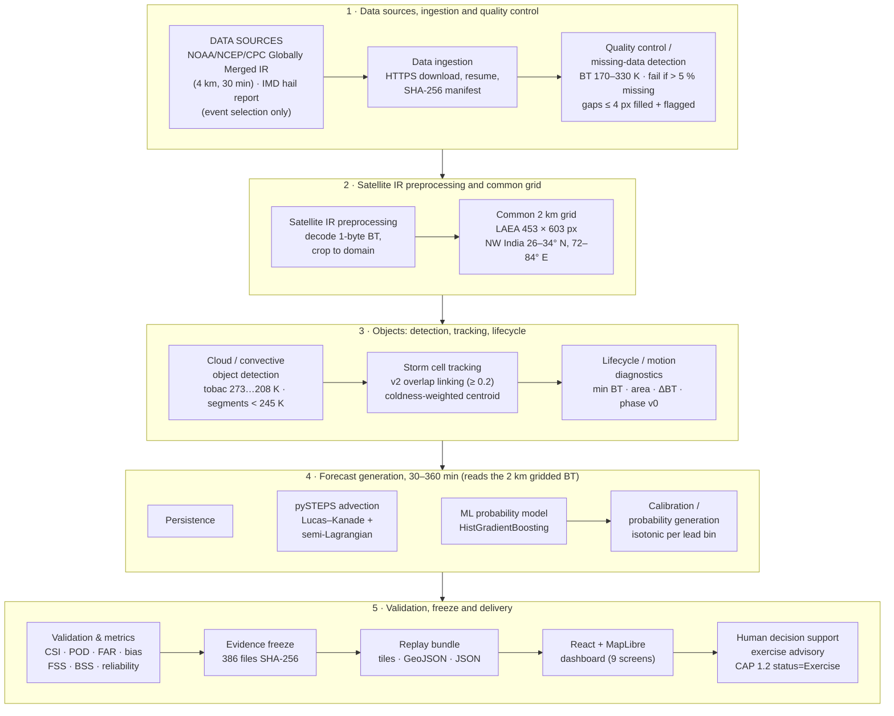
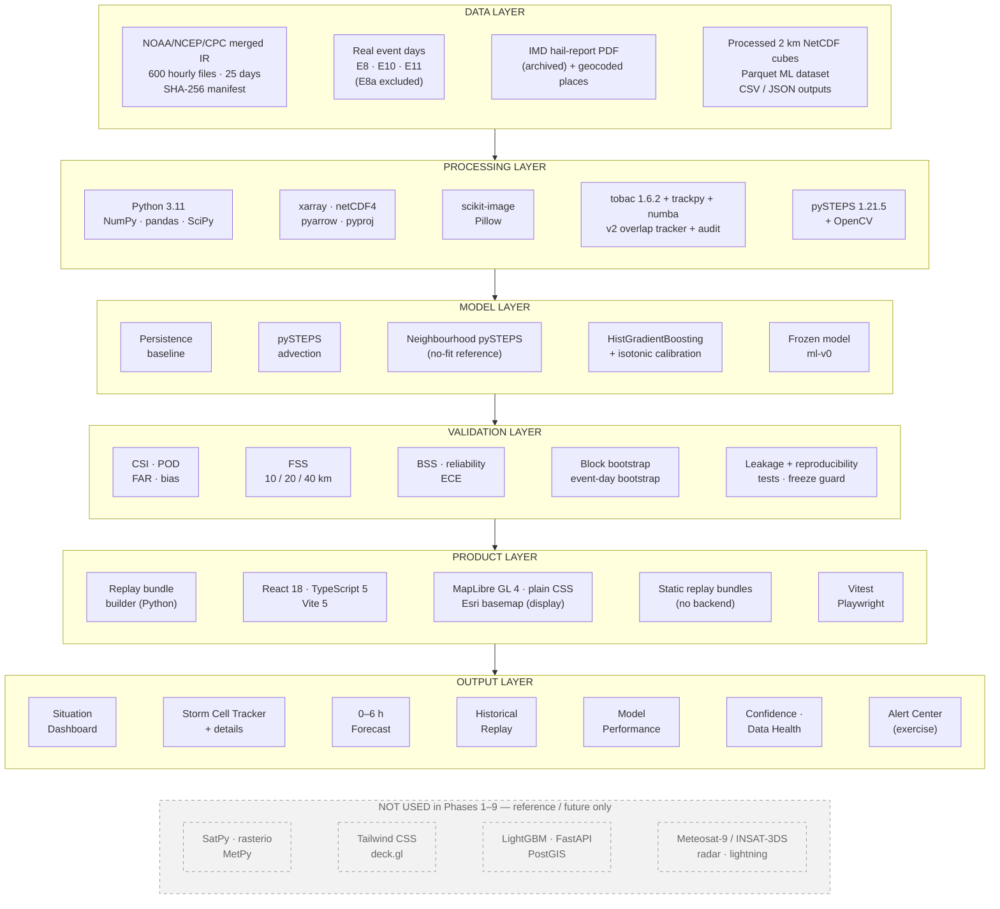
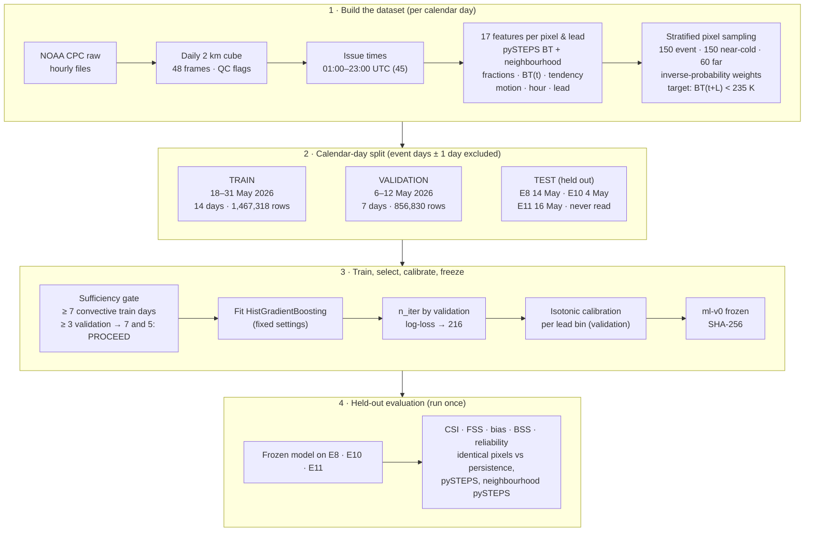
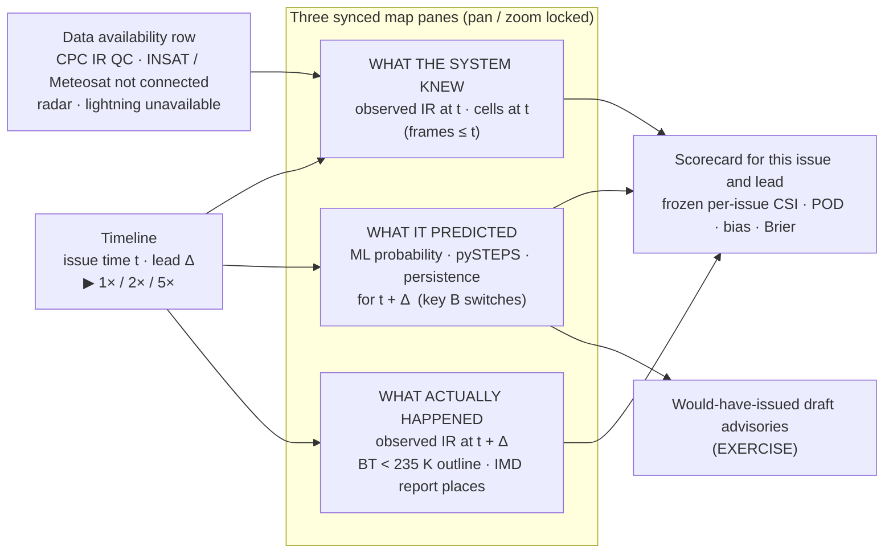
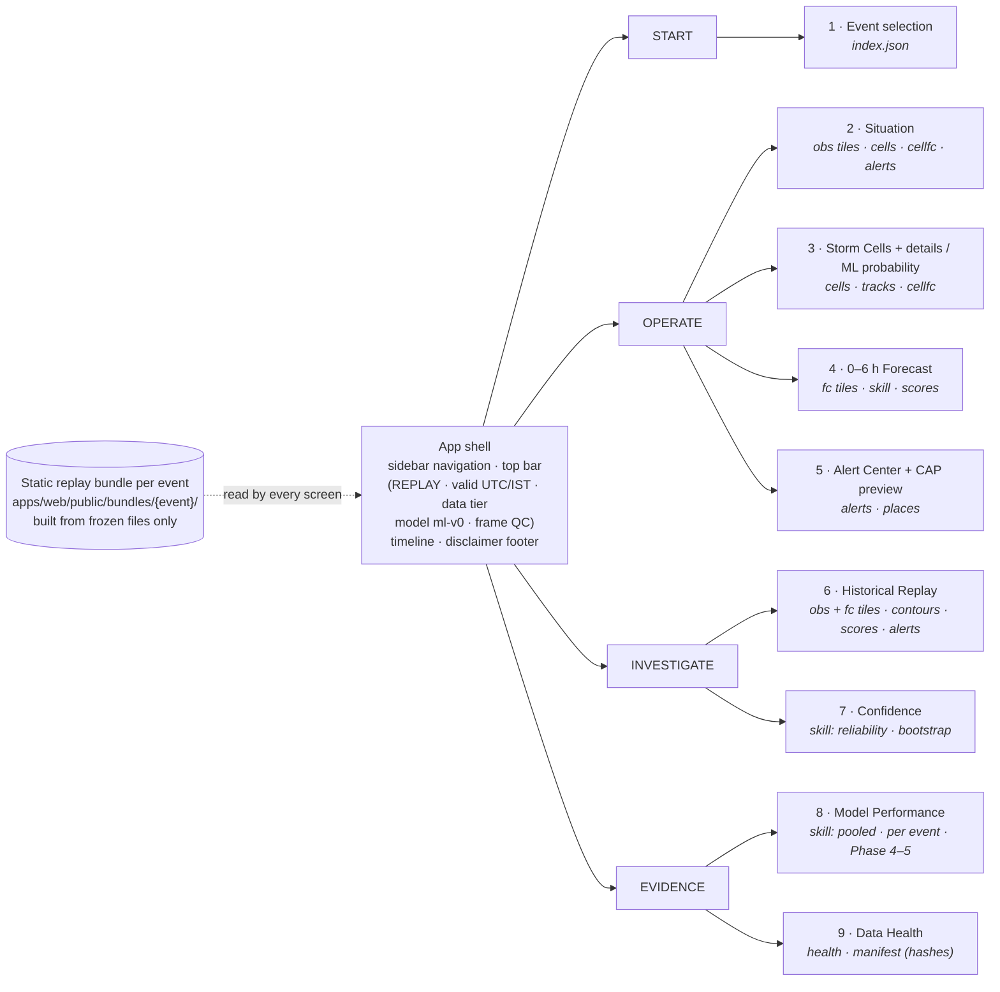

# SIH26084 — System Diagrams

**Convention:** solid boxes are implemented and used. Dashed grey boxes are planned or reference only, and are **not** implemented.

**Sources for every label:**
- `docs/FIRST_EVENT.md`, `docs/BASELINE_EVAL.md`, `docs/TRACKING_AUDIT.md`, `docs/MULTI_EVENT.md`
- `docs/ML_PROTOTYPE.md`, `docs/PRODUCT_DEMO.md`, `docs/FREEZE_ml-v0.json`

---

## Diagram 1 — End-to-end system flowchart

*Figure D1.* End-to-end workflow as implemented, read top to bottom and left to right within each stage. The grid forecasts (persistence, pySTEPS, ML) read the 2 km gridded BT fields. Cells and lifecycle diagnostics feed the object diagnostics and the dashboard.

---

## Diagram 2 — Layered system architecture

*Figure D2.* Layered architecture. Only the technologies in the solid layers were used. The dashed box lists items named in the PRD/ARCHITECTURE that were **not** used in Phases 1–9.

---

## Diagram 3 — Data / ML pipeline

*Figure D3.* ML data pipeline and time-blocked splits. The test events were scored once with the frozen model.

---

## Diagram 4 — Historical replay workflow

*Figure D4.* Replay workflow. It uses saved outputs only; it is not a live feed, and product latency is not modelled.

---

## Diagram 5 — Prototype / dashboard information architecture

*Figure D5.* Dashboard information architecture: navigation groups, screens, and the bundle files each screen reads (italics). Keyboard keys 1–9 open the screens in this order.
