<div class="cover">

<p style="font-size:11pt;color:#6B6457;letter-spacing:0.08em">SMART INDIA HACKATHON 2026 · FINAL TECHNICAL REPORT</p>

<h1 style="font-size:26pt;border:0;margin:6px 0 4px">StormLife Nowcast</h1>
<p style="font-size:15pt;margin:0 0 18px;color:#1F2A44">Satellite-first convective-scale nowcasting of deep convection for India (0–6 h): implementation, validation and replay prototype</p>

| | |
|---|---|
| **Problem Statement ID** | SIH26084 |
| **Problem Statement title** | Convective Scale Nowcasting for Thunderstorms, Hail &amp; Cloudbursts (0–6 hr) |
| **Organisation** | Ministry of Earth Sciences (MoES) / NCMRWF |
| **Category / Theme** | Software / Disaster Management |
| **Team name** | [TEAM NAME] |
| **Team ID** | [TEAM ID] |
| **Team leader** | [TEAM LEADER] |
| **Team members** | [MEMBER 1] · [MEMBER 2] · [MEMBER 3] · [MEMBER 4] · [MEMBER 5] |
| **Institution** | [INSTITUTION / COLLEGE], [CITY, STATE] |
| **Mentor(s)** | [MENTOR NAME(S)] |
| **Report status** | Documents Phases 1–9, evidence frozen at model version **ml-v0** |
| **Date** | [SUBMISSION DATE] |

<p style="margin-top:22px;font-size:9.5pt;color:#6B6457">Research prototype. Not an official IMD warning. All results are replays of observed satellite data on held-out days; no live or operational forecasting is claimed.</p>

</div>

## Contents

1. Cover page · 2. Executive summary · 3. Problem statement · 4. Motivation and background · 5. Objectives · 6. Proposed solution · 7. Key innovation / differentiation · 8. Complete system workflow · 9. System architecture · 10. Technology stack · 11. Data sources · 12. Data pipeline · 13. Storm detection and tracking · 14. Forecasting methods · 15. ML model · 16. Validation methodology · 17. Results · 18. Real event validation · 19. Product / dashboard · 20. Historical replay · 21. Data health and uncertainty · 22. Testing and reproducibility · 23. Running the prototype · 24. Use cases / impact · 25. Limitations · 26. Future scope · 27. Conclusion · 28. References · 29. Appendices A–G

**How to read this report.**
- Numbers are copied from frozen project files; the source is named beside each important value.
- Results are labelled **OBSERVED RESULT** (a measured number), **INTERPRETATION** (what we think it means) or **LIMITATION** (what it does not show).
- Items marked **FUTURE** or **NOT IMPLEMENTED** do not exist in the prototype.

<div class="pb"></div>

# 2. Executive summary

**Problem.** SIH26084 asks for 0–6 h nowcasting of thunderstorms, hail and cloudbursts at 1–3 km, from radar, satellite and lightning data, shown on a GIS dashboard. In practice there is no open, live Indian radar or lightning feed that a student team can train on or verify against:
- IMD Doppler-radar raw data needs a licence;
- the IMD AWS/ARG portal was closed to the public in May 2025;
- general MOSDAC users receive INSAT data with a 3-day latency.

**Approach: satellite-first.** We built the whole system around the one source that was openly obtainable: the **NOAA/NCEP/CPC Globally Merged IR** product (single ~11 µm channel, 4 km, 30 min). It is used as an approved fallback for Meteosat-9/INSAT. We forecast one verifiable target: **where the cloud top will be colder than 235 K (deep convection)**, 30 min to 6 h ahead, on a 2 km grid over NW India (26–34° N, 72–84° E).

**Storm detection and tracking.**
- Cold-cloud objects are detected with tobac.
- The first tracks were audited before any cell-level result was used, and failed. Direction reversals were 47 %, and 20.6 % of cold links were likely identity switches.
- They were replaced by overlap-based tracking with a coldness-weighted centroid, which cut likely identity switches to 0.4 %.

**Baseline forecasting.** Persistence and pySTEPS motion extrapolation were scored on three held-out hail-report days: 14 May (E8), 4 May (E10) and 16 May 2026 (E11).
- pySTEPS beats persistence at **every lead on all three days**: pooled CSI 0.586 vs 0.511 at 30 min, and 0.258 vs 0.176 at 2 h.
- Useful skill lasts about **90 min (persistence) and 120 min (pySTEPS)**.
- An exact error decomposition shows that pySTEPS' apparent over-forecasting at long leads is mainly a scoring-edge effect, not ignored storm decay.
- A decay-aware extension was stopped by a pre-declared rule, because the cell lifecycle trends did not persist.

**ML probability prototype (ml-v0).**
- **Model:** a histogram gradient-boosting classifier with isotonic calibration.
- **Data:** trained on 14 days (18–31 May 2026) and calibrated on 7 days (6–12 May 2026); the three event days were held out.
- **Probability skill:** the best of all methods out to about 4 h. Brier skill score is 0.67 / 0.51 / 0.27 / 0.13 at 30 min / 1 h / 2 h / 3 h, against 0.63 / 0.41 / 0.02 / −0.23 for a no-fit neighbourhood pySTEPS probability.
- **Calibration:** good, with calibration error 0.002–0.004.
- **As a yes/no forecast at p ≥ 0.5** it does **not** beat pySTEPS beyond 1 h.
- **Mechanism:** it behaves mainly as a calibrated, lead-aware smoothing of pySTEPS. Storm-initiation skill is not demonstrated.

**Replay, validation and decision support.**
- **Evidence freeze:** all evidence (386 files) is frozen with SHA-256 hashes, and a test fails if any of it changes.
- **Web prototype:** a static React + TypeScript + MapLibre app replays the frozen outputs across nine screens: event selection, situation, storm cells, 0–6 h forecast, alert center (exercise), historical replay, confidence, model performance and data health.
- **Replay view:** three synced maps show what the system knew, what it predicted and what actually happened.
- **Labelling:** every screen is marked REPLAY; the ML output is shown as a probability with its validated skill.

**Limits.**
- Only 3 held-out days, all in May 2026 over NW India, and the ML test is backward in time.
- The input is a 30-min, single-channel IR source, with unverified parallax.
- There is no independent radar or lightning truth, and no live feed.

<div class="pb"></div>

# 3. Problem statement

The official statement (SIH portal, PS ID **SIH26084**, MoES/NCMRWF; transcribed in the research report, Part 1) asks teams to:
- *"Build a real-time, convective-scale Nowcasting System (0–6 hour lead time) operating at a hyper-local 1–3 km spatial resolution"*;
- design a system *"rooted in Multi-Source Data Fusion architectures"*;
- *"ingest high-frequency, heterogeneous meteorological streams, automatically detect early convective initiation, and dynamically forecast severe storm parameters"*.

The expected inputs are Doppler weather radar (reflectivity and velocity), geostationary satellite imagery (INSAT-3D/3DR thermal/IR bands) and ground-based lightning networks. The expected output is *"a real-time, interactive GIS-mapped dashboard showcasing high-resolution (1–3 km) hazard zones with live countdown clocks for storm arrivals."*

| Requirement (PS) | What this project delivers | Status |
|---|---|---|
| 0–6 h lead time | Forecasts at 30, 60 … 360 min (30-min steps) | Implemented; useful skill ≈ 2 h (baselines), BSS > 0 to ≈ 4 h (ML) |
| 1–3 km resolution | 2 km common grid (effective ≈ 4 km, source resolution) | Implemented |
| Multi-source fusion (radar, satellite, lightning) | Satellite IR only (NOAA CPC merged IR) | **Partial**: radar and lightning not openly available |
| Convective initiation detection | Not demonstrated | **Not implemented** |
| Thunderstorm / deep-convection nowcast | BT < 235 K probability and deterministic forecasts | Implemented and validated on 3 days |
| Lightning density, hail probability, downburst velocity, cloudburst thresholds | No hazard-specific truth available | **Not implemented**; no skill claimed |
| GIS dashboard | React + MapLibre replay prototype, 9 screens | Implemented (replay only) |
| Live countdown clocks / real time | Replay of observed data; latency not modelled | **Not implemented** (future) |
| Users: local administrations, aviation, farming | Exercise advisories (CAP 1.2, status=Exercise) | Prototype only; alert skill not verified |

**Target hazards and the scope decision.** The PS lists thunderstorms, lightning, hail, downbursts and cloudbursts. We scoped the verifiable part to **deep convection**, defined as cloud-top brightness temperature (BT) below 235 K (VALIDATION_PLAN §2). It can be verified from the satellite field itself. The other hazards need truth data (radar, lightning, hail pads, rain gauges) that were not openly available. They are treated as future work, and no skill is claimed for them.

# 4. Motivation and background

**Why 0–6 h convective forecasting is hard.** Convective cells form, grow and decay within tens of minutes to a few hours. Extrapolation methods (moving the current field along its motion) cannot create new storms or model decay, so their skill falls quickly with lead time. The PRD expected skill to decay after about 1–2 h, and the project measured this directly: useful extrapolation skill ends at about 2 h (Section 17).

**Why the data situation matters in India** (research report Part 6, verified at the time of writing):
- **Radar:** IMD Doppler weather radar (DWR) raw volumes need a licence or MoES research request (DATA_REALITY: *UNAVAILABLE / RESTRICTED*).
- **Station data:** the IMD AWS/ARG portal was locked to the public in May 2025.
- **INSAT via MOSDAC:** registered general users get limited datasets with a **3-day latency**; near-real-time access is for privileged users only.
- **Lightning:** Blitzortung's terms forbid use in storm-warning systems. ISS-LIS ended on 16 Nov 2023. NRSC and IITM networks need research access.
- **Operational nowcasting:** IMD's radar-based nowcasts (WDSS-II) cover radar-served cities, 156 per the research report.

A design that depends on radar or lightning cannot be built and verified openly. A **satellite-first** design can.

**Existing operational context.** Storm-lifecycle and cell-hazard systems already exist: NWCSAF RDT-CW, MeteoSwiss TRT and NOAA ProbSevere v3 (research report Part 9; REVIEW_AND_SCOPE R6). The concept is therefore **not novel**. The project's contribution is a verified, reproducible, satellite-only implementation on Indian storm days, with its limits stated (Section 7).

# 5. Objectives

| # | Objective (measurable) | Outcome |
|---|---|---|
| O1 | Build a reproducible real-data pipeline: download → QC → 2 km grid → cells, with SHA-256 provenance | **Achieved.** Byte-identical reruns; raw-file manifest with URL, Last-Modified, size, SHA-256 |
| O2 | Detect and track convective cells, and audit tracking quality before using cell-level metrics | **Achieved.** v1 tracks rejected by the audit; v2 overlap tracking cut ID-switch candidates 0.206 → 0.004 (E8) |
| O3 | Produce and verify persistence and pySTEPS forecasts at 30–360 min | **Achieved.** 45 issue times per day, 12 leads, CSI/POD/FAR/bias/FSS |
| O4 | Test whether baseline findings generalise to 2–3 more real events, with uncertainty | **Achieved.** E10 and E11 added (E8a excluded by rule); block-bootstrap intervals |
| O5 | Explain the remaining forecast error and test a decay-aware extension | **Diagnosis achieved.** Extension **stopped** by a pre-declared reliability rule |
| O6 | Train a lightweight, leakage-safe ML model and evaluate it once on held-out days against the baselines | **Achieved.** ml-v0 evaluated on E8/E10/E11; calibrated probabilities |
| O7 | Freeze all evidence and guard it with tests | **Achieved.** 386 files hashed; freeze-guard test |
| O8 | Deliver a working replay prototype of the dashboard | **Achieved.** 9 screens; build, unit and browser tests pass |

# 6. Proposed solution

StormLife Nowcast is a pipeline that turns raw geostationary IR frames into verified forecasts and a replayable decision-support view:

1. **Ingest** NOAA CPC merged-IR hourly files (two half-hour fields each). Every file is recorded in a manifest with its SHA-256.
2. **Quality-control and regrid.** Decode brightness temperature, fill tiny gaps (≤ 4 native pixels, flagged), and regrid onto a 2 km Lambert azimuthal equal-area (LAEA) grid of 453 × 603 pixels. Each frame gets a QC status.
3. **Detect and track cells.** tobac detects cold-cloud features and segments cells colder than 245 K. The v2 tracker links cells frame to frame by area overlap and assigns a coldness-weighted centroid. Lifecycle diagnostics include min BT, area, cold-core area, ΔBT and phase rules v0 (proposed).
4. **Forecast** the 2 km BT field 30–360 min ahead with three methods:
   - **persistence** (no change);
   - **pySTEPS** (Lucas–Kanade motion + semi-Lagrangian advection);
   - **ML (ml-v0)**: a calibrated probability that BT < 235 K.
5. **Verify** every method on identical pixels of held-out days: CSI, POD, FAR, bias, FSS, Brier skill score and reliability, with block-bootstrap uncertainty.
6. **Freeze** the evidence (386 files, SHA-256).
7. **Build static replay bundles** from the frozen files only, checking each file's hash.
8. **Replay** the bundles in a React + MapLibre dashboard with honest labels. Forecasters can approve or reject exercise advisories (CAP 1.2, status=Exercise).

# 7. Key innovation / differentiation

These are the project's defensible differentiators. None is claimed to be universally novel. Operational systems with related concepts exist (Section 4).

| Differentiator | What was actually done | Evidence |
|---|---|---|
| **Satellite-first workflow** | End-to-end system on openly obtainable geostationary IR, with no simulated radar or lightning | FIRST_EVENT; DATA_REALITY; Section 11 |
| **Reproducible real-event validation** | Real hail-report days, selected by a rule fixed before scoring; 386 evidence files hash-frozen | MULTI_EVENT §1; FREEZE_ml-v0.json |
| **Baseline-relative evaluation** | Every method scored against persistence and pySTEPS on the same pixels. Negative results reported (yes/no ML, decay model stop) | BASELINE_EVAL; ML_PROTOTYPE; DECAY_AWARE |
| **Lifecycle / tracking audit** | Tracks audited before cell-level use; v1 rejected, v2 overlap tracking adopted | TRACKING_AUDIT |
| **Calibrated ML probability prototype** | Isotonic calibration on validation days only; reliability and ECE reported on held-out days | ML_PROTOTYPE §3 |
| **Uncertainty / data-health visibility** | Per-frame QC, source status, unscorable fraction, within-event intervals shown in the UI | Data Health and Confidence screens |
| **Historical replay** | *Knew / predicted / happened* panes with a method toggle, using only data available at issue time | REPLAY_SPEC; PRODUCT_DEMO |
| **Explainable decision-support interface** | Every forecast shows its validated skill at that lead, evidence level and envelope. Advisories require human approval | UI_UX_SPEC; Section 19 |

<div class="pb"></div>

# 8. Complete system workflow

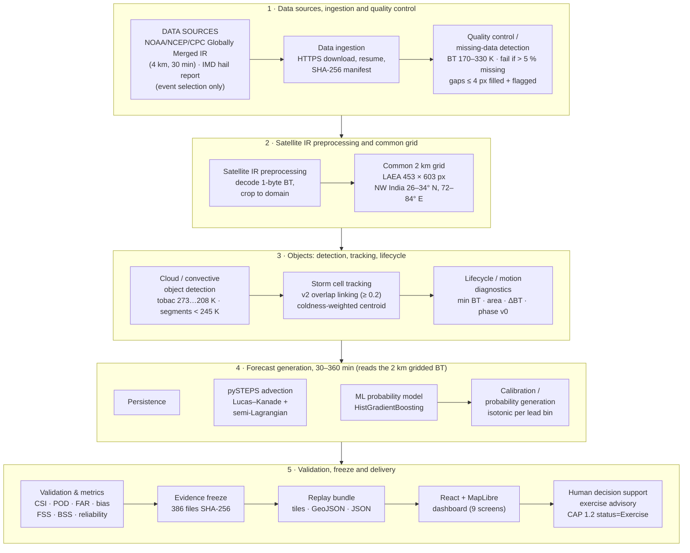

*Figure 1 (Diagram 1).* End-to-end system flowchart. Source: `docs/DIAGRAMS.md`.

<div class="pb"></div>

# 9. System architecture

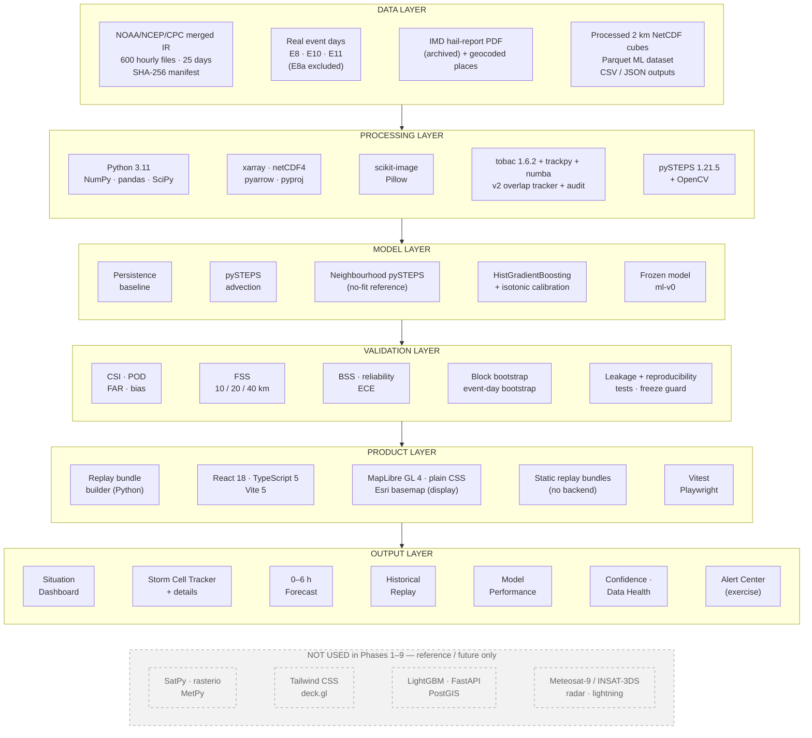

*Figure 2 (Diagram 2).* Layered architecture. Solid layers contain only technologies used in Phases 1–9. The dashed box lists technologies named in the PRD/ARCHITECTURE that were **not** used: SatPy, rasterio, MetPy, Tailwind CSS, deck.gl, LightGBM, FastAPI, PostGIS.

**Layer notes:**
- **Data layer.**
  - 600 hourly raw files over 25 days (the 4 event days E8/E8a/E10/E11 plus 21 training/validation days), about 16 GB.
  - Processed outputs are NetCDF cubes, Parquet ML rows and CSV/JSON metric tables.
- **Processing layer.**
  - Python 3.11.
  - tobac 1.6.2 uses trackpy for linking, with numba for speed.
  - pySTEPS 1.21.5 was built from the PyPI source with `-fopenmp` removed; there is no macOS arm64 wheel and Apple clang has no OpenMP. This affects only multithreading of code paths the project does not use.
- **Model layer.** Two deterministic baselines, a no-fit neighbourhood reference and one ML model (ml-v0), frozen.
- **Validation layer.** Metric code in `ml/verification/scores.py`. The FSS equals the pySTEPS implementation (tested).
- **Product layer.** A static site. There is no backend server and no database; the bundles are plain files.
- **Output layer.** Nine screens (Section 19).

# 10. Technology stack

Status legend:
- **Implemented:** code written in this project.
- **Used:** third-party library or service used at run time.
- **Reference:** named in project docs but not used.
- **Future:** planned, not built.

| Category | Technology (version) | Purpose | Status |
|---|---|---|---|
| Programming | Python 3.11.16 (uv virtual environment) | All data, tracking, forecasting, ML and verification code | Used |
| Programming | TypeScript 5.9.3 | Web prototype source | Used |
| Programming | Node.js 26.7.0 / npm 11.19.0 | Web build tooling | Used |
| Data processing | NumPy 2.4.6 · pandas 3.0.6 · SciPy 1.17.1 | Arrays, tables, filters (neighbourhood fractions, FSS) | Used |
| Data processing | xarray 2026.7.0 · netCDF4 1.7.4 | Gridded cubes and forecast files (NetCDF) | Used |
| Data processing | pyarrow 25.0.1 | Parquet (ML dataset, tobac features) | Used |
| Data processing | PyYAML 6.0.3 · requests 2.34.2 | Configs; HTTPS download with resume | Used |
| Weather / scientific | pyproj 3.7.2 | LAEA grid, reprojection to the display grid, geodesic motion | Used |
| Weather / scientific | pySTEPS 1.21.5 (local build) + OpenCV 5.0.0.93 | Lucas–Kanade motion, semi-Lagrangian extrapolation, FSS cross-check | Used |
| Tracking | tobac 1.6.2 · trackpy 0.7 · numba 0.67.0 | Multi-threshold feature detection, 245 K segmentation, v1 linking | Used |
| Tracking | v2 overlap tracker (`ml/tracking/overlap_link.py`) | Overlap linking, merge/split events, coldness centroid | Implemented |
| Tracking | scikit-image 0.26.0 | Segmentation support (tobac) and contour extraction for map polygons | Used |
| ML | scikit-learn 1.9.1: `HistGradientBoostingClassifier`, `IsotonicRegression` | ML probability model and calibration | Used |
| ML | joblib 1.6.0 | Model serialisation (frozen artifacts) | Used |
| Visualization | matplotlib 3.11.2 | Scientific figures (figs 1–21) | Used |
| Visualization | Pillow 12.3.0 | 8-bit data tiles for the web bundles | Used |
| Frontend | React 18.3.1 · react-dom 18.3.1 | Dashboard UI (9 screens) | Used |
| Frontend | Plain CSS with UI_UX_SPEC design tokens · IBM Plex fonts (Google Fonts) | Styling | Used |
| Mapping | MapLibre GL JS 4.7.1 | Map, raster image source, GeoJSON cells/contours, synced replay panes | Used |
| Mapping | Esri World Light Gray Canvas tiles | Basemap (display only; can be switched off) | Used |
| Geocoding | OpenStreetMap Nominatim | Geocoding the IMD hail-report place names | Used |
| Storage | Files: NetCDF, Parquet, CSV, JSON, GeoJSON, PNG, joblib | All data and outputs; SHA-256 manifests | Used |
| Storage | PostGIS / any database | Planned in ARCHITECTURE | Future |
| Testing | pytest 9.1.1 | 77 Python tests (76 pass, 1 skip) | Used |
| Testing | Vitest 2.1.9 | 6 web unit tests | Used |
| Testing | Playwright 1.63.0 (headless Chromium) | 2 end-to-end browser tests of the demo flow | Used |
| Build / deployment | Vite 5.4.21 · @vitejs/plugin-react 4.7.0 | Type-checked production build and local preview | Used |
| Build / deployment | Docker, FastAPI, cloud hosting | Planned in ARCHITECTURE | Future |
| Reference only | SatPy, rasterio, MetPy, xskillscore | Named in ARCHITECTURE; not installed | Reference |
| Reference only | Tailwind CSS, deck.gl | Named in ARCHITECTURE/UI spec; plain CSS and MapLibre layers used instead | Reference |
| Reference only | LightGBM, PyTorch, SHAP | LightGBM replaced by scikit-learn's histogram GBDT (same family); no deep learning | Reference |

*Table 1.* Technology stack. Versions come from the project environment (`requirements.txt`, `apps/web/package.json`, `docs/FREEZE_ml-v0.json`).

<div class="pb"></div>

# 11. Data sources

| Source | Data type | Time step | Grid | Period used | Usage | Limitations | Reproducibility |
|---|---|---|---|---|---|---|---|
| **NOAA/NCEP/CPC Globally Merged IR** (`ftp.cpc.ncep.noaa.gov/precip/global_full_res_IR/`) | Merged geostationary window-channel IR BT (~11 µm), 1-byte (BT − 75 K), 255 = missing | 30 min (2 fields per hourly file) | 4 km (regridded to 2 km) | 1, 4, 6–12, 14, 16, 18–31 May 2026 (25 days, 600 hourly files ≈ 16 GB) | **All model inputs and verification truth** | Single channel; 30-min cadence; archive on the server starts 30–31 Mar 2026 then 1 May (**no April 2026**); satellite ID code 5 unverified; parallax status unverified | `data/raw/cpc_merged_ir/manifest.json`: URL, HTTP Last-Modified, bytes, SHA-256 per file; `pipelines.ingest.cpc_merged_ir` |
| CPC satellite-ID file (`geomerg_satid_202605.Z`) | Satellite contributing each pixel | Monthly file | 4 km | May 2026 | Diagnostic (one satellite, code 5, covers the domain) | Code-to-satellite mapping NEEDS VERIFICATION | Same manifest |
| **IMD RMC New Delhi hail-storm report** (PDF, updated 16 May 2026) | Hail occurrence by date and place | Daily (date only, no time) | Town names | Feb–May 2026 | **Event-day selection and map context only**, never verification truth | Place/state column layout lost in text extraction; reports incomplete; no times | Archived as `hailstorm_report_face59166ab1.pdf` with SHA-256 |
| OpenStreetMap Nominatim | Place coordinates | — | Point | — | Geocoding report places | Some names not found (Shirsi; Jubbarhatti, Hindon AFS; Tungnath) | Cached in `data/raw/hail_reports/geocoded_*.json` |
| Esri World Light Gray Canvas | Basemap tiles | — | Web tiles | — | Display context only | Terms for public deployment and boundary depiction NEEDS VERIFICATION | Online; can be switched off |
| Meteosat-9 IODC SEVIRI | Multi-channel 15-min imagery | 15 min | ~3 km nadir | — | Planned primary | Not connected (no EUMETSAT token) | — |
| INSAT-3DR / 3DS (MOSDAC) | Multi-channel imagery | 30 min (15 min staggered) | 1–8 km by channel | — | Planned | Not connected; 3-day latency for general users | — |
| IMD DWR radar; lightning networks | Reflectivity; flashes | — | — | — | Planned independent truth | Unavailable / restricted | — |

*Table 2.* Data sources. The only data inputs are the CPC merged IR frames.

**Source substitution.**
- The approved satellite routes in DATA_REALITY (Meteosat-9 IODC via EUMETSAT; INSAT via MOSDAC) need credentials that were not available. EUMETSAT download returned HTTP 404 without a token, and there was no MOSDAC account.
- The CPC merged-IR product was therefore adopted in Phase 1 as an approved fallback. It was kept for all later phases, where the instructions were "keep NOAA IR as the approved Phase-1 fallback; do not acquire new satellite sources".
- Consequences: no water-vapour, visible or tri-spectral channels, and a 30-min cadence instead of 15 min.
- Long-term archive access for older years (e.g. NASA GES DISC GPM_MERGIR, which needs an Earthdata login) was not verified.

# 12. Data pipeline

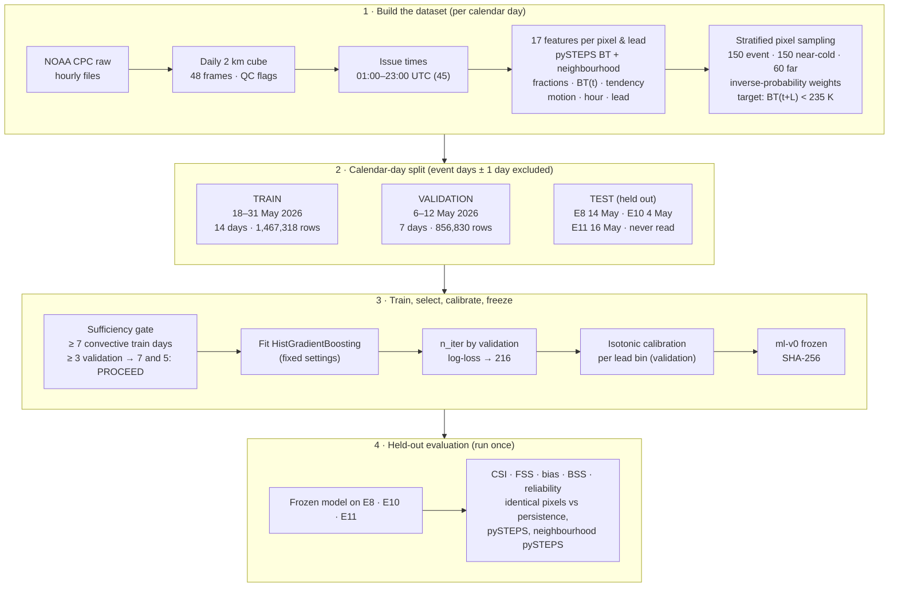

*Figure 3 (Diagram 3).* Data / ML pipeline, including the calendar-day splits used for the ML prototype.

| Step | Implementation | Settings (frozen) |
|---|---|---|
| Raw satellite data | Hourly `.Z` files, two half-hour fields each; parallel HTTPS download with resume and file-locked manifest | Resume via HTTP Range; total size checked |
| Decoding | 1-byte value + 75 → BT in K; 255 → missing; rows north → south | `pipelines/preprocess/decode.py` |
| Missing-data handling | Source gaps of ≤ 4 connected native pixels filled from valid 8-neighbours and flagged in a `gapfilled` mask; larger gaps stay missing | E8: 0.8–6.1 % missing per frame before fill, 0.6–5.4 % after |
| Projection / grid | NaN-aware bilinear regridding (normalised weights, minimum weight 0.5) onto LAEA (centre 30° N, 78° E), 2 km | 453 × 603 px; `in_domain` mask for 26–34° N, 72–84° E; effective resolution ≈ 4 km |
| Frame QC | Status `OK` if in-domain missing ≤ 5 % and all BT in 170–330 K; otherwise `QC_FAIL` | Failed frames are **kept and flagged**, not dropped (E8: 6, E10: 9, E11: 0) |
| Cloud-top temperature | BT field per 30-min frame (48 frames per day, 00:00–23:30 UTC) | — |
| Convective thresholds | Deep convection = BT < 235 K (forecast target); cell segmentation < 245 K; cold core < 221 K | VALIDATION_PLAN §2; `config/tracking.yaml`; `config/phases.yaml` |
| Object detection | tobac multi-threshold features at 273 / 253 / 235 / 221 / 208 K | Minimum size 25 px at 273 K, 8 px at 253 K, 4 px colder |
| Tracking | v1 tobac/trackpy (rejected by audit); v2 overlap linking of < 245 K segments (adopted) | Section 13 |
| Forecast input | 2 km BT cube (grid methods); cell tables (object diagnostics, dashboard) | Issue times 01:00–23:00 UTC: 45 per day |

*Table 3.* Data-pipeline steps and settings. Sources: FIRST_EVENT, BASELINE_EVAL, `config/*.yaml`.

**LIMITATION: parallax.** Missing pixels line cloud edges. That pattern is consistent with holes left by a parallax shift in the merged product. Whether the product is already parallax-corrected is **not verified**. The project applies no parallax correction, so cloud-top positions may be displaced for tall clouds.

# 13. Storm detection and tracking

**Cold-cloud object detection (tobac 1.6.2).**
- **Features:** detected on BT at thresholds 273, 253, 235, 221 and 208 K (target = minimum).
- **Minimum sizes:** 25 px at 273 K (100 km²), 8 px at 253 K, 4 px at colder levels. At 4 px the 273 K level produced 3,581 small warm fragments on 14 May, which made trackpy's linking fail.
- **Segmentation:** watershed at 245 K.
- **v1 linking:** trackpy `random` method, v_max 30 m/s, 2-frame minimum. The trackpy subnetwork cap was raised to 50 (Phase 4) after 1 May produced a 34-point subnetwork; E8 tracks re-ran byte-identically.
- **v1 merge/split:** tobac `merge_split_MEST` at 25 km.

**Tracking audit (Phase 3).** Before any cell-level result was used, the v1 tracks were audited on E8. The metrics:
- **direction reversals:** the share of consecutive steps that reverse direction (random = 0.5);
- **ID-switch candidates:** another object overlaps the parent more than the linked one;
- **zero-overlap links;**
- **area jumps:** more than 2× between frames;
- **correlation with the pySTEPS flow.**

| Audit metric (E8) | v1 tobac tracks | v2 overlap tracks (adopted) | v2 flow-shifted variant |
|---|---|---|---|
| Cells (≥ 2 h) | 613 (181) | 88 (23) | 95 (22) |
| Direction reversals (random = 0.5) | 0.47 (0.38 cold rows only) | 0.35 | 0.27 |
| ID-switch candidates (fraction of cold links) | 0.206 | 0.004 | 0.127 |
| Zero-overlap links | 0.057 | 0 (guaranteed by the rule) | 0 |
| Area jumps > 2× | 0.40 | 0.28 | 0.29 |

*Table 4.* Tracking audit before and after the fixes. Source: `data/processed/E8_20260514/audit/audit_*.json`; TRACKING_AUDIT.

**OBSERVED RESULT: v1 problems.**
- 81 % of tracked rows were warm features.
- 15.5 % of steps changed detection level; those steps moved a median 28.5 km, against 19.9 km otherwise.
- Members of the same merge/split family present at the same time were a median 68 km apart (maximum 221 km).
- Nearest-feature truth biased the Phase-2 object results toward persistence.

**Fixes (v2, implemented in `ml/tracking/overlap_link.py`).**
1. Only cold segments (< 245 K) are treated as storms.
2. **Overlap linking.** A cell continues into the next-frame segment with mutual best overlap. Overlap is measured relative to the smaller object and must be at least 0.2. Extra overlaps are recorded once each as MERGE or SPLIT events, and families are built from them. Linking uses only the current and next frame.
3. **Coldness-weighted centroid.** Pixels are weighted by 245 K − BT, which steadies the position.

Overlap thresholds of 0.1–0.3 gave essentially the same results.

**Motion estimation.**
- Cell step motion (speed, heading) comes from consecutive centroids. It remains jittery (27–35 % reversals).
- The dashboard's motion arrows therefore use the pySTEPS **field** motion: the cell centre advected 30 min by the Lucas–Kanade field.

**On the other events** (MULTI_EVENT §6), E10 / E11:
- v1 tracks: reversals 0.46 / 0.46, ID-switch candidates 0.23 / 0.09.
- v2 tracks: reversals 0.33 / 0.21, ID switches 0.00 / 0.00, area jumps 0.28 / 0.24.

**LIMITATION.**
- Area jumps (≈ 28 %) remain. They come from watershed segmentation, not from merges and splits, so areas and growth rates are not reliable.
- There is no independent truth (radar, lightning or manual labels) to decide which linking rule is right, and the PRD's ≥ 90 % tracking criterion is not assessed.
- Phase rules v0 are *proposed*, not validated.
- **Object-level claims are diagnostic only, and only to 30 min** (Section 17.9).

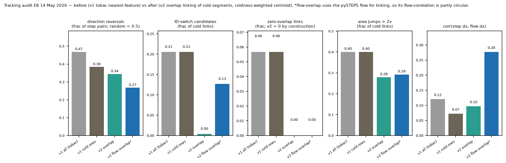

*Figure 4.* Tracking audit, E8: v1 tobac vs v2 overlap tracks. Source: `data/figures/E8_20260514_fig8_tracking_audit.png`.

# 14. Forecasting methods

All forecasts are issued at each 30-min frame from 01:00 to 23:00 UTC (45 issue times per day), for leads of 30, 60 … 360 min. **A forecast issued at frame k reads only frames ≤ k** (tested by destroying future frames).

## 14.1 Persistence

The observed BT field at the issue time is repeated unchanged for every lead: BT(t + L) = BT(t). It has no parameters. It is the minimum reference: any useful method must beat it.

## 14.2 pySTEPS advection

- **Motion:** pySTEPS 1.21.5 **Lucas–Kanade** dense optical flow, estimated from the last three frames (t − 60, t − 30, t min). The tracer is cloud-top "coldness", max(0, 273 K − BT), so warm surfaces are ignored.
- **Extrapolation:** **semi-Lagrangian advection** of BT(t) along that motion for up to 12 steps.
- **Inflow:** pixels whose trajectories come from outside the grid have no forecast (NaN). They are excluded from scoring, and the excluded fraction is reported.
- **Fitting:** none. Settings were fixed in `config/baseline.yaml` before evaluation.
- **Deterministic event:** forecast BT < 235 K.
- **No-fit reference (NP31):** the fraction of pySTEPS event pixels in a 31 × 31-pixel (62 km) window. It gives a probability without any fitting and is used to judge whether the ML adds more than smoothing.

## 14.3 ML prototype

A per-pixel probability that BT(t + L) < 235 K, from a histogram gradient-boosting classifier with isotonic calibration. It uses the pySTEPS forecast and recent-IR features (Section 15). The deterministic ML event is p ≥ 0.5, the threshold pre-declared from VALIDATION_PLAN §2.

**Decay-aware extension: not built (Phase 5).**
- The simplest extension would extrapolate each cell's recent Lagrangian tendency (min-BT or log-area change), with AR(1) damping.
- A rule set before computing was: build only if a tendency persists on the development event (E8), with lag-1 coefficient φ > 0 and a 95 % cell-bootstrap interval excluding 0.
- No tendency passed. Min-BT φ = −0.03 [−0.22, 0.15]; log-area φ = 0.16 [−0.01, 0.31]; cold-core φ = −0.25 [−0.53, 0.03]. **Decision: STOP.**

# 15. ML model

| Item | Value (frozen) | Source |
|---|---|---|
| Model version | **ml-v0** | `data/models/ml-v0/model_card.json` |
| Model type | `sklearn.ensemble.HistGradientBoostingClassifier` (histogram GBDT, the LightGBM family; LightGBM not installed) + `IsotonicRegression` | `config/ml_dataset.yaml` |
| Hyper-parameters (fixed before training) | learning rate 0.05; max 31 leaf nodes; min 500 samples per leaf; L2 1.0; no internal early stopping (it would split pixels at random); random_state 0 | model card |
| Number of trees | **216**, chosen by minimum weighted validation log-loss over 400 staged iterations, then refit | model card; fig. 21 |
| Target | Observed BT(t + L) < 235 K at each 2 km pixel | `config/ml_dataset.yaml` |
| Lead times | 30, 60, 90 … 360 min (12 leads) | — |
| Features (17) | lead; pySTEPS BT at t + L; pySTEPS event fraction in 11 × 11 and 31 × 31 px; pySTEPS min in 11 × 11 px; pySTEPS valid fraction in 31 × 31 px (edge proxy); BT(t); BT(t) event fraction 31 × 31; BT(t) min 11 × 11; 30-min tendency (raw and advected); neighbourhood mean of advected tendency; motion speed; domain cold fraction and its 60-min change; valid hour (sin, cos). **No latitude, longitude or terrain.** | `ml/features/grid_features.py` |
| Training period | 18–31 May 2026: 14 days, of which 7 convective; 1,467,318 sampled rows | model card |
| Calibration / validation period | 6–12 May 2026: 7 days, of which 5 convective; 856,830 rows; used only for tree count and isotonic calibration | model card |
| Test period (held out) | E8 14 May, E10 4 May, E11 16 May 2026; never read in training; scored once with the frozen model | ML_PROTOTYPE §1 |
| Excluded | All event days (1, 4, 14, 16 May) ± 1 day | dataset manifest |
| Sampling | Per (day, issue, lead): 150 event, 150 near-cold non-event, 60 far non-event pixels, with inverse-probability weights (weighted totals reproduce the full grid, tested) | `config/ml_dataset.yaml` |
| Sufficiency gate | ≥ 7 convective training days and ≥ 3 convective validation days; result 7 and 5, so PROCEED | model card |
| Calibration | Isotonic per lead bin (30 / 60 / 90–120 / 150–360 min), validation days only. Weighted log-loss 0.0552 raw → 0.0529 calibrated | model card |
| Deterministic threshold | p ≥ 0.5 (pre-declared, not tuned) | VALIDATION_PLAN §2 |
| Freeze | `model.joblib` SHA-256 `597e3c06c5db7ec2…`; `calibrators.joblib` `0da01eb8bd2f3598…`; `model_card.json` `2a763b0aaeae9858…` | `docs/FREEZE_ml-v0.json`; PROVENANCE §Phase 7 |

*Table 5.* ML model card summary.

**INTERPRETATION: what the model learned.**
- Permutation importance on a validation-day subsample ranks the features by the increase in weighted log-loss:

| Feature | Log-loss increase |
|---|---|
| pySTEPS 31-px event fraction | 0.019 |
| Lead | 0.008 |
| BT(t) neighbourhood fraction | 0.005 |
| Motion speed | 0.003 |
| pySTEPS minimum | 0.003 |
| Advected-tendency mean | 0.003 |

- Diurnal terms add ≈ 0.001–0.002. Domain-scale and raw-BT features add nothing (≤ 0).
- **The model is mainly a calibrated, lead-aware neighbourhood refinement of pySTEPS, with modest tendency and time-of-day information.**
- **Storm initiation (new development) was not demonstrated**, and no initiation-specific score exists.
- After calibration, probabilities from 150 min onward never reach 0.5, because high raw probabilities verified only about 27 % of the time on validation days.

# 16. Validation methodology

**Event selection.** Rules fixed before any scoring (`config/events.yaml`):
- The date is printed in the archived IMD hail report.
- All 24 hourly CPC files exist.
- At least 2 reported places geocode inside the domain.
- The date is not within ±1 day of another selected event.

**Suitability rule** (also fixed beforehand): all 48 frames present, and BT < 235 K present in ≥ 50 % of frames.
- **Results:** E8, E10 and E11 passed. E8a (1 May) failed with 21 % deep-convection frames and was excluded.
- **Unavailable:** E9 (5 and 9 April 2026), because April is missing from the archive.

**Time-blocked separation.**
- **Grid baselines:** no fitted parameters, so the only leakage risk is future data; every forecast uses frames ≤ issue time (tested).
- **ML:** calendar-day blocks, no random pixel splits:
  - train 18–31 May;
  - validation 6–12 May;
  - test E8/E10/E11;
  - ±1-day buffers around every event day.
- **LIMITATION:** the archive starts 1 May, so training days come **after** the test days (backward-in-time test).

**Leakage checks** (automated tests):
- features unchanged when future frames are destroyed;
- no test or buffer day in any training or validation file;
- lifecycle tendencies unchanged when later rows are deleted;
- isotonic calibration reproduces its validation log-loss (it was fitted on validation rows);
- a split touching a test day is rejected.

**Identical-pixel scoring.** Mask **V** = inside the domain, and valid in the observation, the persistence forecast and the pySTEPS forecast. Every method is scored on the same pixels (tested). A second mask **D** includes the inflow edge, where pySTEPS has no forecast; D is used for edge-only diagnostics.

**Metrics** (VALIDATION_PLAN §2), from the contingency table of hits H, misses M and false alarms F:

| Metric | Definition | What it measures |
|---|---|---|
| POD | H/(H+M) | Share of observed events that were forecast |
| FAR | F/(H+F) | Share of forecast events that did not happen |
| CSI | H/(H+M+F) | Overall yes/no agreement |
| Frequency bias | (H+F)/(H+M) | Over- (> 1) or under-forecasting (< 1) of event area |
| FSS | Roberts & Lean (2008), at 10 / 20 / 40 km | Spatial agreement at a given scale; "useful" if ≥ 0.5 + f₀/2 |
| BSS | 1 − BS/BS_ref, reference = training-split climatology per lead | Probability skill; deterministic methods enter as 0/1 probabilities |
| Reliability / ECE | 10 bins; ECE = Σ\|Σp − Σo\|/n | Calibration |

**Uncertainty.**
- Within each event: a circular block bootstrap over issue times, with 6-h blocks (the longest lead), 1000 resamples, seed 20260925, and hits/misses/false alarms (or Brier sums) re-pooled on each resample.
- Across events: a bootstrap by event day. With 3 events it is **indicative only**; the best possible one-sided sign-test p is 0.125.

**Error decomposition (Phase 5).** Pooled frequency bias factorises exactly as bias = **E × C × G**:
- **E (edge):** the effect of scoring only the region pySTEPS can forecast;
- **C:** the change in advected cold area;
- **G:** the observed domain cold-area change, i.e. unchanged intensity.

An oracle that matches forecast area to the observation bounds what any uniform growth/decay correction could gain. It uses the observation and is not a forecast.

**Reproducibility.** Reruns produced byte-identical CSVs (baselines, v2 tracks, cross-event tables, dataset days, reliability gate). Every output is listed with its SHA-256 in per-phase provenance files, and all 386 evidence files are frozen (Section 22).

# 17. Results

All values: held-out event days, mask V, event = BT < 235 K.
- P = persistence
- A = pySTEPS advection
- NP31 = no-fit neighbourhood pySTEPS
- ML = ml-v0 calibrated

## 17.1 Single-event baseline (E8, 14 May 2026)

| Lead (min) | Excluded fraction | CSI P / A | POD P / A | FAR P / A | Bias P / A | FSS 20 km P / A | FSS 40 km P / A |
|---|---|---|---|---|---|---|---|
| 30 | 0.087 | 0.509 / **0.593** | 0.688 / 0.802 | 0.338 / 0.306 | 1.04 / 1.16 | 0.792 / **0.853** | 0.851 / 0.898 |
| 60 | 0.112 | 0.352 / **0.428** | 0.534 / 0.684 | 0.493 / 0.467 | 1.05 / 1.28 | 0.635 / **0.713** | 0.700 / 0.771 |
| 120 | 0.162 | 0.191 / **0.245** | 0.327 / 0.481 | 0.684 / 0.666 | 1.03 / 1.44 | 0.400 / **0.480** | 0.448 / 0.534 |
| 180 | 0.211 | 0.106 / **0.156** | 0.192 / 0.351 | 0.809 / 0.780 | 1.01 / 1.60 | 0.237 / 0.333 | 0.266 / 0.371 |
| 240 | 0.258 | 0.077 / 0.109 | 0.139 / 0.267 | 0.852 / 0.844 | 0.94 / 1.71 | 0.169 / 0.244 | 0.187 / 0.271 |
| 360 | 0.348 | 0.038 / 0.043 | 0.066 / 0.148 | 0.919 / 0.943 | 0.82 / 2.61 | 0.084 / 0.099 | 0.097 / 0.110 |

*Table 6.* E8 grid baselines, pooled over 45 issue times. Source: `data/processed/E8_20260514/baseline/grid_metrics_by_lead.csv`; BASELINE_EVAL §3. The useful FSS threshold is ≈ 0.51.

## 17.2 Baselines on three events (Phase 4)

| Lead (min) | CSI P / A: E8 | CSI P / A: E10 | CSI P / A: E11 | Bias P / A: E8 | Bias P / A: E10 | Bias P / A: E11 |
|---|---|---|---|---|---|---|
| 30 | 0.509 / **0.593** | 0.514 / **0.582** | 0.492 / **0.589** | 1.04 / 1.16 | 1.08 / 1.11 | 1.02 / 1.13 |
| 60 | 0.352 / **0.428** | 0.336 / **0.428** | 0.341 / **0.441** | 1.05 / 1.28 | 1.13 / 1.18 | 1.01 / 1.23 |
| 120 | 0.191 / **0.245** | 0.169 / **0.263** | 0.160 / **0.283** | 1.03 / 1.44 | 1.11 / 1.21 | 0.85 / 1.40 |
| 180 | 0.106 / **0.156** | 0.089 / **0.178** | 0.025 / **0.213** | 1.01 / 1.60 | 1.04 / 1.15 | 0.56 / 1.56 |
| 240 | 0.077 / **0.109** | 0.043 / **0.130** | 0.001 / **0.110** | 0.94 / 1.71 | 0.98 / 1.07 | 0.41 / 1.68 |
| 360 | 0.038 / 0.043 | 0.019 / 0.054 | 0.000 / 0.002 | 0.82 / 2.61 | 0.91 / 0.97 | 0.80 / 1.53 |

*Table 7.* Per-event CSI and frequency bias. Source: `data/processed/multi_event/event_metrics_by_lead.csv`; MULTI_EVENT §4.

| Lead (min) | Pooled CSI P | Pooled CSI A | Events with A better (CSI and FSS 40 km) |
|---|---|---|---|
| 30 | 0.511 | 0.586 | 3 / 3 |
| 60 | 0.342 | 0.429 | 3 / 3 |
| 120 | 0.176 | 0.258 | 3 / 3 |
| 180 | 0.092 | 0.172 | 3 / 3 |
| 360 | 0.022 | 0.049 | 3 / 3 |

*Table 8.* Cross-event pooled CSI. Source: `data/processed/multi_event/cross_event_by_lead.csv`.

| | E8 | E10 | E11 |
|---|---|---|---|
| Useful FSS 40 km (P / A) | to 90 / 120 min | to 90 / 120 min | to 90 / 120 min |
| Useful FSS 20 km (P / A) | to 60 / 90 min | to 60 / 90 min | to 60 / 120 min |
| CSI e-folding time, 30–180 min fit (P / A) | 96 / 113 min | 87 / 128 min | 54 / 149 min |
| Within-event 95 % interval of CSI(A) − CSI(P) excludes 0 at | 30–240 min | 30–360 min | 30 min only |

*Table 9.* Skill decay and within-event uncertainty. Source: `decay_by_event.csv`, `event_block_bootstrap.csv`; MULTI_EVENT §4–5.

- **OBSERVED RESULT.** pySTEPS beats persistence on CSI and FSS 40 km at every lead on all 3 days. Useful skill ends at about 2 h.
- **INTERPRETATION.** The Phase-2 finding on E8 was repeated on two more days.
- **LIMITATION.** Three events cannot give cross-event significance (best sign test p = 0.125). E11 is weak (base rate 0.4 %), so its intervals are wide.

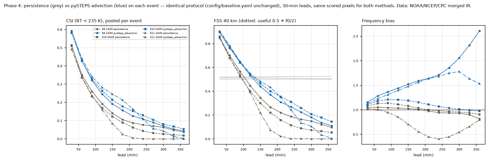

*Figure 5.* CSI, FSS 40 km and frequency bias vs lead for each event. Source: `data/figures/multi_event_fig11_skill_by_event.png`.

## 17.3 Why skill fades: bias decomposition (Phase 5)

| Event | Lead (min) | Bias (scored region) | Edge E | Advected area C | Intensity G | Whole-domain bias | Observed cold pixels in edge | CSI P / A / oracle |
|---|---|---|---|---|---|---|---|---|
| E8 | 120 | 1.44 | 1.33 | 1.08 | 1.00 | 1.09 | 30 % | 0.191 / 0.245 / 0.269 |
| E8 | 360 | 2.61 | 3.76 | 0.73 | 0.96 | 0.70 | 76 % | 0.038 / 0.043 / 0.048 |
| E10 | 120 | 1.21 | 1.11 | 1.03 | 1.06 | 1.09 | 17 % | 0.169 / 0.263 / 0.283 |
| E11 | 120 | 1.40 | 1.19 | 1.22 | 0.97 | 1.18 | 19 % | 0.160 / 0.283 / 0.337 |
| E11 | 360 | 1.53 | 4.80 | 1.25 | 0.26 | 0.32 | 80 % | 0.000 / 0.002 / 0.010 |

*Table 10.* Exact bias factorisation (bias = E × C × G). Source: `data/processed/multi_event/phase5/decomposition_by_lead.csv`; DECAY_AWARE §2.

- **OBSERVED RESULT.**
  - The growing pySTEPS bias is mostly the edge term. On E8 at 6 h, the bias is 2.61 on the scored region but 0.70 over the whole domain.
  - Pooled over each day, the intensity term is small on E8/E10.
  - By time of day it shows growth for morning issues and decay for afternoon/evening issues.
- **INTERPRETATION.**
  - New and entering storms upstream cannot be forecast by extrapolation.
  - Even a perfect uniform area correction adds at most +0.035 CSI on E8 and +0.026 on E10.
  - Placement error and new development dominate the remaining error.
- **LIMITATION.** The oracle covers uniform corrections only.

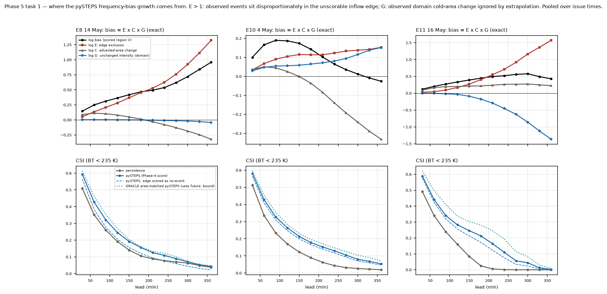

*Figure 6.* Bias decomposition and CSI (persistence, pySTEPS, edge-scored, oracle) by lead. Source: `data/figures/phase5_fig14_bias_decomposition.png`.

## 17.4 ML vs baselines (Phase 6, held-out E8 + E10 + E11 pooled)

| Lead (min) | CSI P / A / NP31 / ML (p ≥ 0.5) | FSS 40 km A / ML (event mean) | Bias A / ML | BSS P / A / NP31 / **ML** |
|---|---|---|---|---|
| 30 | 0.511 / 0.586 / 0.596 / 0.583 | 0.901 / 0.886 | 1.13 / 0.76 | 0.32 / 0.44 / 0.63 / **0.67** |
| 60 | 0.342 / 0.429 / 0.444 / 0.452 | 0.773 / 0.778 | 1.22 / 0.66 | −0.04 / 0.10 / 0.41 / **0.51** |
| 120 | 0.176 / 0.258 / 0.264 / 0.243 | 0.543 / 0.525 | 1.30 / 0.54 | −0.47 / −0.38 / 0.02 / **0.27** |
| 180 | 0.092 / 0.172 / 0.172 / 0.000 | 0.402 / 0.000 | 1.32 / 0.00 | −0.69 / −0.67 / −0.23 / **0.13** |
| 240 | 0.052 / 0.122 / 0.116 / 0.000 | 0.276 / 0.000 | 1.28 / 0.00 | −0.78 / −0.82 / −0.37 / **0.06** |
| 360 | 0.022 / 0.049 / 0.045 / 0.000 | 0.086 / 0.000 | 1.29 / 0.00 | −0.84 / −1.11 / −0.59 / −0.03 |

*Table 11.* Final comparison. Source: `data/processed/ml_eval/ml-v0/metrics_pooled_lead.csv`, `metrics_by_event_lead.csv`; ML_PROTOTYPE §3; FINAL_RESULTS Slide 1.

| Event | 30 min | 60 min | 120 min | 180 min |
|---|---|---|---|---|
| E8 | +0.04 [0.03, 0.11] | +0.12 [0.04, 0.36] | +0.27 [0.04, 0.92] | +0.49 [0.10, 1.63] |
| E10 | +0.03 [0.01, 0.11] | +0.11 [0.03, 0.50] | +0.26 [0.08, 0.95] | +0.31 [0.05, 1.37] |
| E11 | 0.00 [−0.03, 0.09] | +0.01 [−0.07, 0.19] | +0.16 [−0.12, 0.86] | +0.26 [−0.17, 1.46] |

*Table 12.* BSS(ML) − BSS(NP31) per event, with 95 % within-event block-bootstrap intervals. Source: `bootstrap_ml_vs_pysteps.csv`; ML_PROTOTYPE §3.

- **OBSERVED RESULT.**
  - ML has the highest BSS at every lead to 4 h (0.67, 0.51, 0.27, 0.13, 0.06 at 30 min to 4 h), and it is −0.03 at 6 h.
  - Its gain over the no-fit neighbourhood reference is significant within E8 and E10, but not within E11.
  - As a yes/no forecast (p ≥ 0.5), ML CSI beats pySTEPS only at 60 min (0.452 vs 0.429). It is lower at 30 and 120 min, and 0 from 150 min.
  - The CSI(ML) − CSI(pySTEPS) intervals include 0 at 30–120 min on all events. From 150 min the upper bound is ≤ 0.
- **INTERPRETATION.**
  - The ML advantage is in **probability skill**, not in yes/no maps beyond 1 h.
  - The calibrated model will not issue high probabilities at long leads, which is honest calibration rather than a display failure.
- **LIMITATION.**
  - This is not "ML beats pySTEPS" in general.
  - There is no 6-h skill, and no skill across events can be established from 3 days.
  - The BSS reference (training climatology) differs from the test-day base rates.

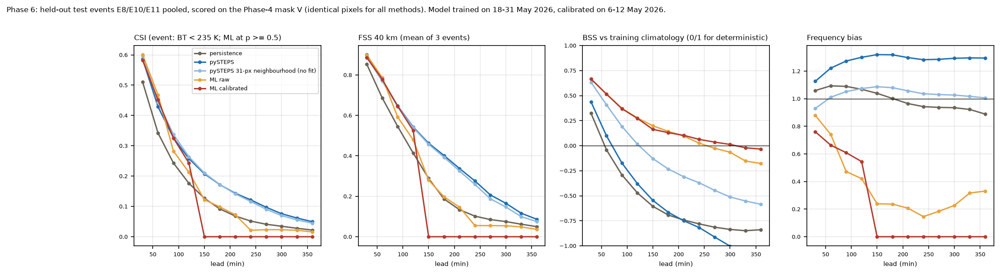

*Figure 7.* CSI, FSS 40 km, BSS and bias vs lead for all methods, held-out events pooled. Source: `data/figures/phase6_fig17_skill_vs_lead.png`.

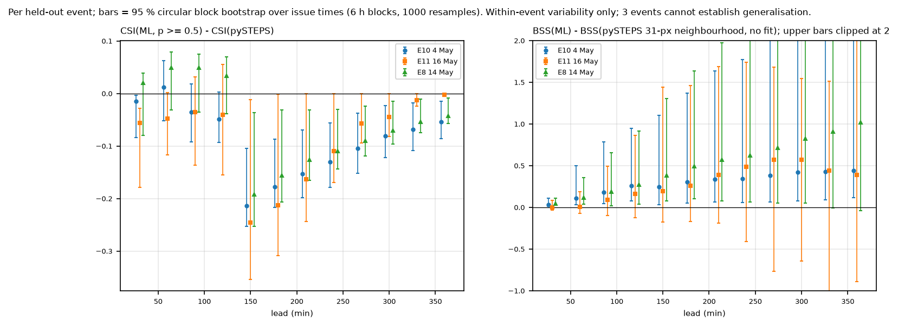

*Figure 8.* Per-event CSI(ML) − CSI(pySTEPS) and BSS(ML) − BSS(NP31), with block-bootstrap intervals. Source: `data/figures/phase6_fig18_ml_minus_pysteps_ci.png`.

## 17.5 Calibration

| Lead bin (min) | ECE (ML) | ECE (NP31) |
|---|---|---|
| 30 | 0.0022 | 0.0023 |
| 60 | 0.0034 | 0.0082 |
| 90–120 | 0.0042 | 0.0163 |
| 150–360 | 0.0026 | 0.0301 |

*Table 13.* Expected calibration error on held-out days (10 bins). Source: `data/processed/ml_eval/ml-v0/reliability.csv`; FINAL_CLAIMS A7.

- **OBSERVED RESULT.** ML probabilities are close to the reliability diagonal in every lead bin. NP31 is over-confident from 60 min on.

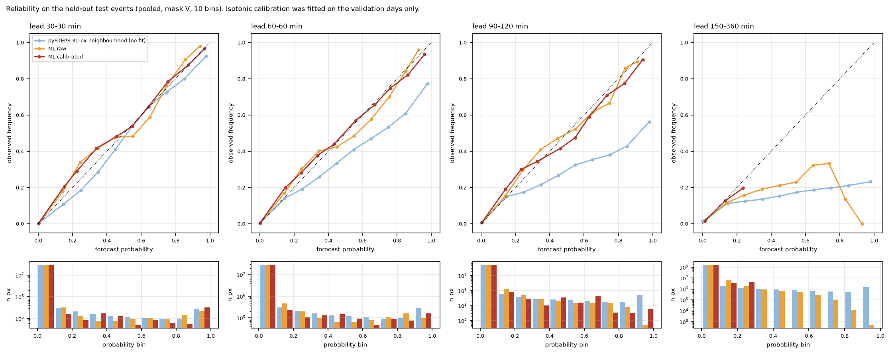

*Figure 9.* Reliability diagrams with counts, per lead bin. Source: `data/figures/phase6_fig19_reliability.png`.

## 17.6 Inflow edge

- **OBSERVED RESULT.** On pixels that pySTEPS cannot forecast (outside V):
  - ML BSS is 0.43 at 30 min and 0.22 at 120 min, vs 0.37 and 0.11 for NP31;
  - at 30 min, ML POD is 0.38 vs 0.21 for pySTEPS.
- **INTERPRETATION.** This is the one place the model adds placement information for entering storms. Source: `metrics_edge_only.csv`.

## 17.7 Event-wise findings

| Event | Main finding | Caveat |
|---|---|---|
| E8 (14 May) | Strong day (base rate 2.7 %); pySTEPS > P at all leads; ML > NP31 (intervals above 0, 30 min to 3 h) | 6 QC-fail frames (10:00–12:30 UTC) |
| E10 (4 May) | Strongest day (base rate 4.2 %); smallest pySTEPS bias growth (1.11 → 1.21, then ≈ 1.0) | 9 QC-fail frames (17:00–21:30 UTC) |
| E11 (16 May) | Weak day (base rate 0.4 %); pySTEPS > P; ML not significantly better than NP31 | Small sample; wide intervals |

*Table 14.* Event-wise summary. Sources: MULTI_EVENT §4–7; ML_PROTOTYPE §3.

## 17.8 Tracking audit results

See Table 4 (Section 13). **OBSERVED RESULT:** v2 removes ID switches (0.206 → 0.004 on E8; 0.00 on E10 and E11). **LIMITATION:** area jumps (≈ 0.28) and 21–35 % direction reversals remain.

## 17.9 Object diagnostics (diagnostic only)

- **OBSERVED RESULT.** At 30 min, pySTEPS-field advection places cold cells closer than persistence on all 3 events: 0.59 / 0.62 / 0.57 of paired cases (43 / 66 / 18 cells).
- **LIMITATION.**
  - At 60 min the advantage fails on E11 (0.42, 15 cells), so object claims stop at 30 min.
  - Cell positions have no independent truth.
- Source: `object_diagnostics_by_event.csv`.

## 17.10 Reproducibility and test results

See Section 22. **OBSERVED RESULT:** 76 Python tests pass (1 skipped), 6/6 web unit tests, 2/2 browser tests; the build passes; the freeze guard confirms that all 386 frozen files are unchanged.

<div class="pb"></div>

# 18. Real event validation

| Code | Date | Reported hail places (in domain) | Frames | Issue times | QC-fail frames | Deep-convection frames | Role |
|---|---|---|---|---|---|---|---|
| **E8** | 14 May 2026 | 16 (15) | 48 | 45 | 6 | 92 % | Phase-1 reference; held-out test |
| **E10** | 4 May 2026 | 10 (10) | 48 | 45 | 9 | 96 % | Held-out test |
| **E11** | 16 May 2026 | 5 (3) | 48 | 45 | 0 | 65 % | Held-out test (weak event) |
| E8a | 1 May 2026 | 20 (17) | 48 | — | 0 | 21 % | **Excluded:** fails the pre-declared suitability rule (≥ 50 %) |
| E9 | 21 Mar, 5 and 9 Apr 2026 | — | 0 | — | — | — | **Unavailable:** before 30 Mar / April missing from the archive |
| E1–E7 | 2018–2025 | — | 0 | — | — | — | **Not available:** before the approved archive (or outside the domain) |

*Table 15.* Event table. Sources: MULTI_EVENT §1, `event_qc.csv`, REPLAY_SPEC §1.

**Selection rationale.** The dates come from the archived IMD RMC New Delhi hail report. Candidates were ranked by number of reported places and filtered by the rule in Section 16. No other candidate qualified: 13, 15, 2, 3 and 5 May are within ±1 day of a selected event; 6 May has 1 in-domain place; 7 May has 1 place; and the PDF ends on 16 May.

**Held-out evaluation.** All three days are excluded, with ±1-day buffers, from ML training and calibration. The grid baselines have no fitted parameters.

**LIMITATION: scope.** Three pre-monsoon days in May 2026, one region (NW India) and one hail report. Nothing is shown for the monsoon, cloudbursts, other regions, other years or other satellites. Hail reports are used only to choose days; they were never verification truth.

<div class="pb"></div>

# 19. Product / dashboard

**The web prototype** (`apps/web/`) is a static React 18 + TypeScript + Vite + MapLibre application.
- **Data:** it reads replay bundles (`apps/web/public/bundles/{event}/`) built by `pipelines/replay/build_bundle.py` from frozen files only; each input hash is checked against the freeze manifest.
- **Bundles:** one per held-out event (E8, E10, E11), each with 20 frozen inputs and 735 output files; 82 MB in total.
- **Tiles:** fields are stored as 8-bit data tiles on a Web-Mercator display grid and colourised in the browser. The display resampling (nearest neighbour) is for drawing only.
- **App shell** (UI_UX_SPEC §3):
  - sidebar with START / OPERATE / INVESTIGATE / EVIDENCE groups and count badges;
  - top bar with the REPLAY badge, valid time in UTC and IST, data tier, model version and frame QC;
  - a 48-frame timeline with QC-fail marks, play at 1×/2×/5×, and a lead selector;
  - keyboard shortcuts (←/→, Space, 1–9, B);
  - the footer disclaimer *"Research prototype — not an official IMD warning"*.

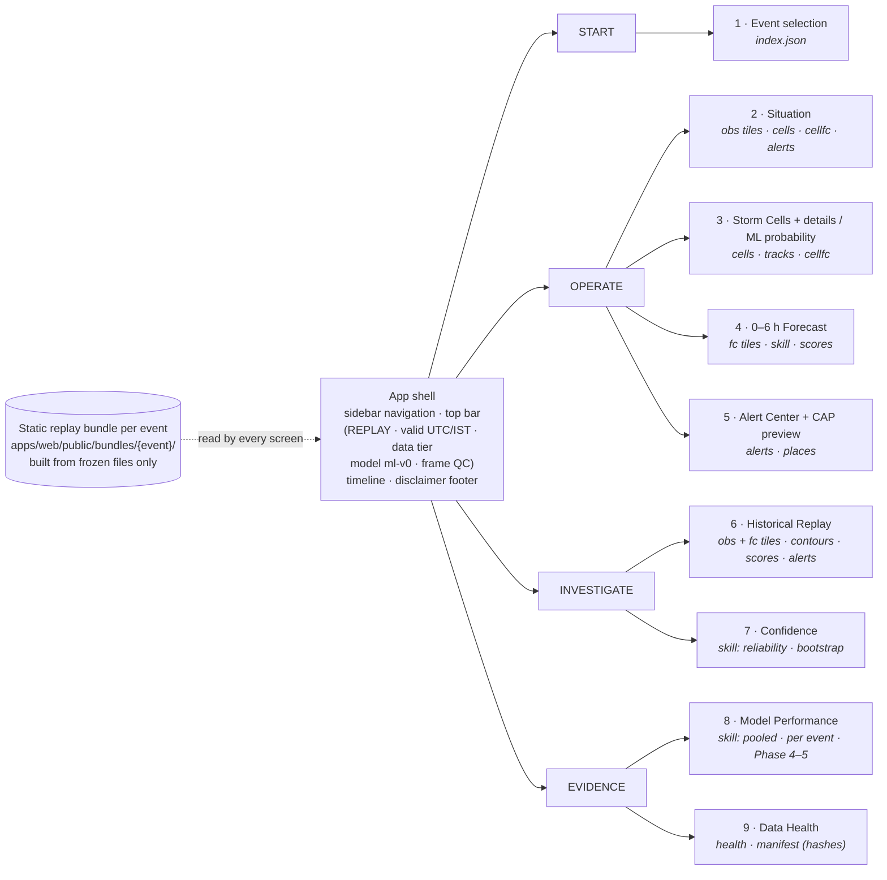

*Figure 10a (Diagram 5).* Dashboard information architecture: navigation groups, screens and the bundle files each screen reads.

| # | Screen | Purpose | Inputs (bundle) | Displayed information | Decision-support value | Status |
|---|---|---|---|---|---|---|
| 1 | Event selection | Choose a real event | `index.json` | Cards E1–E11, with BUNDLED / EXCLUDED / NOT AVAILABLE and the reason | Shows which evidence exists and why others do not | Implemented |
| 2 | Situation dashboard | Current overview | obs tiles, cells, cellfc, alerts | IR map, phase-styled cells (colour + line style), pySTEPS motion arrows; KPIs (active cells, Mature cells, places with P ≥ 0.5 in 60 min, frame QC); top-5 cells by ML risk; source status | Where deep convection is now, and which cells to watch | Implemented |
| 3 | Storm Cell Tracker | Inspect one storm | cells, tracks, cellfc | Selected cell outline; track so far (solid); pySTEPS-advected track to +6 h (dashed, labelled); sortable cell table | Follow a cell's history and likely path | Implemented |
| 4 | 0–6 h Forecast | Forecast at a lead | fc tiles, skill, scores | Persistence / pySTEPS / ML probability at T+30 min to T+6 h; probability threshold; optional observed outcome (replay); skill ribbon (validated CSI, BSS, FSS 40 km, bias; de-emphasised beyond validated skill); envelope; this issue's scores | The forecast with its trustworthiness shown next to it | Implemented (T+15 min disabled: 30-min source) |
| 5 | Storm details / ML probability | Cell-level probability | cells, cellfc | Cell card: phase (rules v0, PROPOSED), min BT, ΔBT 30 min, area, cold core, age so far, merges/splits, motion; sparklines; ML probability by lead near the forecast cell position | Quick risk read for a single storm | Implemented (display summary, not a verified cell metric) |
| 6 | Historical Replay | Honest look-back | obs + fc tiles, contours, scores, alerts | Three synced panes: KNEW / PREDICTED / HAPPENED; method toggle (B); lead Δ; data-availability row; per-issue scorecard; would-have-issued drafts | Lets evaluators see what the system would have said, and how it turned out | Implemented |
| 7 | Model Performance | Evidence | skill | BSS and CSI vs lead (pooled or per event); final comparison table; Phase-4 consistency; Phase-5 decomposition; claim-guard banner | Shows where each method is and is not useful | Implemented (no client-side computation) |
| 8 | Confidence / Data Health | Trust and provenance | skill, health, manifest | Reliability diagrams + ECE; per-event intervals. Source status; per-frame QC strip with raw-file SHA-256; unscorable fraction by lead; model card; limitations; bundle input hashes | Shows when to distrust the output | Implemented |
| 9 | Alert Center | Human-in-the-loop advisories | alerts, places | System status; draft advisories (ML P ≥ 0.5 within 10 km of a report place at +30/+60 min); Approve / Reject; audit log | Nothing issued without approval | Implemented (exercise only; alert skill not verified) |
| 10 | Exercise CAP preview | Standard message | approved draft | CAP 1.2 XML preview and download: `status=Exercise`, disclaimer, source prediction ID, 10 km circle | Interoperable format for a future workflow | Implemented (exercise only) |

*Table 16.* Dashboard screens. Sources: PRODUCT_DEMO; `apps/web/src/screens/*`.

**Screenshot provenance.** Figures 10–14, 16 and 17 are screenshots of the production build replaying the frozen E8 bundle, taken during the verified local browser run. The files are in `apps/web/e2e-shots/`, which is git-ignored. Basemap-off versions are regenerated by `npm run e2e`.


*Figure 10.* Situation dashboard, E8 14 May 2026, 14:00 UTC: 9 active cells; Amritsar flagged by the ML probability; source status. Screenshot from the verified local browser run.


*Figure 11.* Storm Cell Tracker: cell #108 (Developing, min BT 216.1 K), selected by clicking the map, with its observed track, pySTEPS-advected track and ML probability by lead.


*Figure 12.* 0–6 h Forecast, ML probability at T+2h (display threshold 0.5). Skill ribbon: CSI 0.243 · BSS 0.27 · FSS40 0.53 · bias 0.54, with the yes/no caveat.


*Figure 13.* Model Performance screen: claim-guard banner, BSS and CSI vs lead, final comparison table.


*Figure 14.* Alert Center at 08:00 UTC: exercise draft advisories (Shopian P 0.57 at +60 min, Kulgam P 0.69 at +30 min), one approved, with the CAP 1.2 preview (`status=Exercise`).

# 20. Historical replay

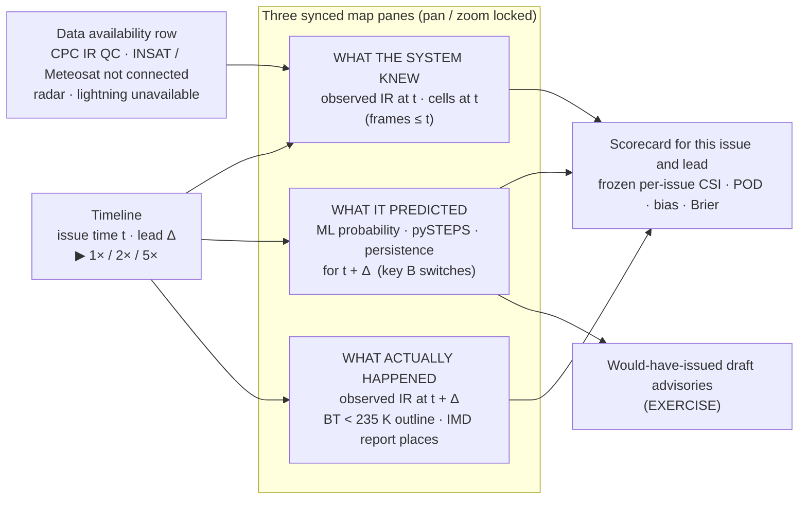

*Figure 15 (Diagram 4).* Historical replay workflow.

**The replay principle** (REPLAY_SPEC). At issue time *t* the screen shows three synced maps with pan and zoom locked:
- **What the system knew:** the observed IR frame at *t* and the cells at *t*. Only frames up to *t* are used.
- **What it predicted:** the forecast for *t* + Δ. Key **B** cycles ML probability → pySTEPS → persistence, so comparisons are like-for-like.
- **What actually happened:** the observed IR at *t* + Δ, the observed BT < 235 K outline, and the IMD-report places.

**Timeline.**
- The timeline steps through the 48 frames. Forecasts exist for the 45 issue times from 01:00 to 23:00 UTC.
- Δ ∈ {30, 60, 120, 180, 240, 360} min.
- Playback runs at 1× (one 30-min step per 2 s), 2× or 5×.

**Below the maps:**
- the per-issue scorecard, which shows the frozen scores of all four methods at that lead;
- the would-have-issued exercise drafts;
- a data-availability row: CPC IR QC status; INSAT not available operationally; Meteosat not connected; radar and lightning unavailable.

**LIMITATION.**
- This is a **replay of saved outputs**, not a live feed. Product latency is not modelled.
- Hail reports have dates only, so alert lead time relative to reported impact cannot be computed.
- One minor exception to "history only": cells seen in a single frame were dropped offline using the next frame. This is stated on screen.


*Figure 16.* Historical Replay screen, E8: the three synced panes with the pySTEPS forecast at T+2h.

# 21. Data health and uncertainty

| Element | What is shown | Source |
|---|---|---|
| QC failures | Per-frame strip (48 frames): OK or QC-fail, bar height = residual missing fraction; E8 has 6 QC-fail frames (10:00–12:30 UTC), kept and flagged | Cube `qc_status`, `qc_missing_frac` |
| Source status | CPC merged IR AVAILABLE (FALLBACK); Meteosat-9 and INSAT NOT CONNECTED; IMD DWR and lightning UNAVAILABLE; IMD hail report AVAILABLE (context only) | DATA_REALITY; bundle `health.json` |
| Confidence | Skill ribbon at every lead; leads beyond validated skill de-emphasised (baselines: useful FSS 40 km; ML: pooled BSS > 0, with a "small" warning when BSS < 0.1) | `skill.json` |
| Calibration / reliability | Reliability diagrams and ECE per lead bin (Table 13) | `reliability.csv` |
| Uncertainty | Within-event block-bootstrap intervals per event (Table 12) | `bootstrap_ml_vs_pysteps.csv` |
| Scorable area | Unscorable fraction by lead (E8: 9 % at 30 min → 35 % at 6 h) | Phase-2 metrics |
| Model card | ml-v0: algorithm, 216 trees, train/validation days, held-out events, threshold p ≥ 0.5, artifact hashes | `model_card.json` |
| Limitations | Listed on screen and in FINAL_CLAIMS §D | `health.json` |
| Hashes / provenance | Raw-file SHA-256 per frame; bundle input hashes (verified against the freeze manifest); freeze-manifest hash | `manifest.json`, `docs/FREEZE_ml-v0.json` |

*Table 17.* Data-health and uncertainty elements.


*Figure 17.* Data Health screen: source status, QC strip, model card.

# 22. Testing and reproducibility

| Suite | Scope | Final result |
|---|---|---|
| Python, `tests/test_phase1.py` | Decoding (scaling, missing, row order), source/target grids, movement, QC flags, phase rules v0, raw-file checksums, cube timing, physical tracks | 10 tests |
| `tests/test_phase2.py` | Scores, FSS = pySTEPS FSS, leakage (future frames destroyed), baseline hashes | 7 tests |
| `tests/test_phase3.py` | Overlap linking, merge/split once, threshold, causality, centroid, E8 v2 validity, Phase 1–2 unchanged | 13 tests |
| `tests/test_phase4.py` | Bootstrap, event selection rule, raw files = manifest, identical protocol, identical pixels, recomputed scores, provenance | 16 tests (1 skipped: excluded event E8a) |
| `tests/test_phase5.py` | Exact bias factorisation, re-scoring = Phase 4, oracle, lifecycle gate STOP, causality | 8 tests |
| `tests/test_phase6.py` | Split/leakage rules, feature causality, sampling weights, dataset re-sampling, training reproducibility, calibration on validation, baselines = Phase 4, identical pixels, one held-out forecast recomputed, download resume, window builder | 13 tests |
| `tests/test_phase7_freeze.py` | All frozen files unchanged; frozen model = evaluated model | 2 tests |
| `tests/test_phase8_bundle.py` | Bundle inputs = frozen files; output hashes; displayed skill = frozen tables; scores = per-issue table; unique exercise alerts; no future information; tiles reproduce ML probability; event index | 8 tests |
| **Python total** | `.venv/bin/python -m pytest -q` | **76 passed, 1 skipped** |
| Web unit (Vitest) | Colour scales, tile decoding, CAP exercise format, time formatting | **6 / 6 pass** |
| Browser end-to-end (Playwright, headless Chromium, production build) | Full E8 demo flow with no page errors and frozen numbers on screen; E10 opens; unavailable events cannot be opened | **2 / 2 pass** |
| Build | `npm run build` (TypeScript type-check + Vite production build); fresh `npm ci` from the lockfile | **Pass** |
| Local-run verification | Browser pass with the basemap on: map-click selection, playback, keyboard navigation, CAP download, E10/E11, 1280-px layout | 0 console errors, 0 page errors, 0 failed local requests, 146/146 map tiles |
| Freeze manifest | `docs/FREEZE_ml-v0.json`: 386 files, SHA-256 `b5c48807bab48dcc…`, frozen 2026-09-25T07:26:44 UTC | Freeze guard passes |
| Byte-identical reruns | Baselines (Phase 2), v2 tracks (Phase 3), cross-event tables (Phase 4), reliability gate (Phase 5), dataset days and training (Phase 6) | Verified |
| Secret scan | **Not performed** in Phases 1–9. Documented controls only: no credentials used or stored (no MOSDAC/EUMETSAT accounts); `.env` is git-ignored | Manual item |

*Table 18.* Test and reproducibility summary. Sources: SUBMISSION_CHECKLIST §7; PROVENANCE; test files.

**Isolation.** The prototype needs no server-side state. The bundles are static files, alert approvals stay in the viewer's browser storage, and a fresh `npm ci` + build from the lockfile was verified.

# 23. Running the prototype

**Prerequisites.**
- Python 3.11 virtual environment at `.venv` with `requirements.txt`. pySTEPS 1.21.5 must be built from the PyPI source with `-fopenmp` removed on macOS arm64 (BASELINE_EVAL §9).
- Node.js ≥ 18 (verified with 26.7.0) and npm.
- Internet for the basemap and fonts. Both are optional: untick *Basemap* for offline use.

**Commands (from the repository root)**, as verified in the local-run check:

```bash
# start the demo (bundles and npm packages already present)
cd apps/web && npm run build && npm run preview          # -> http://localhost:4173/

# fresh checkout: rebuild bundles only if apps/web/public/bundles/ is missing (~4 min), then install
.venv/bin/python -m pipelines.replay.build_bundle --event E8_20260514 E10_20260504 E11_20260516
cd apps/web && npm ci && npm run build && npm run preview

# tests
.venv/bin/python -m pytest -q                            # Python suite incl. freeze guard
cd apps/web && npm test                                  # web unit tests
cd apps/web && npx playwright install chromium && npm run e2e   # browser tests
```

**Notes.**
- Port 4173 must be free; otherwise Vite uses the next port, so read the printed URL.
- Use a fresh private window for a clean demo (Alert Center approvals persist in browser storage).
- No other deployment (server, container, cloud) exists or is claimed.

# 24. Use cases / impact

These are **intended uses of a research prototype**. None has been field-tested, and no operational use by any government agency is claimed.

| Use case | What the prototype supports today | Evidence level |
|---|---|---|
| Meteorological situational awareness | Satellite IR situation map with tracked cold cells and motion, and a probability map of deep convection with its validated skill | Validated on 3 held-out days (grid) |
| Storm monitoring | Per-cell card, history and advected track; top-5 cells by ML risk | Diagnostic (cell skill only to 30 min) |
| Disaster-management decision support | Place-level draft advisories for human review; CAP 1.2 export (`status=Exercise`) | Exercise only; alert skill not verified |
| Historical event analysis | Replay of real days (*knew / predicted / happened*) with method switching | Implemented |
| Research / validation | Reproducible test bed: same baselines, same pixels, frozen evidence, bootstrap intervals; any new model can be scored the same way | Implemented |

*Table 19.* Supported use cases. Coverage potential: geostationary IR covers all of India every 30 min, including areas without radar. The prototype was validated only over NW India.

# 25. Limitations

| Limitation | Current impact | Future improvement |
|---|---|---|
| **Only 3 held-out event days** (E8, E10, E11) | No cross-event significance (best sign test p = 0.125); E11 weak (base rate 0.4 %) | Multi-season, multi-region event set |
| **May 2026, NW India only** | Nothing shown for monsoon, cloudbursts, other regions or years | Monsoon and other-region events |
| **Backward-in-time ML test** | Training (18–31 May) follows the test days; ±1-day buffers limit, but do not rule out, weather-regime overlap | Forward test on new days after 31 May, or on pre-2026 archives |
| **Thin training data** | 14 training days, 7 convective (exactly the gate minimum) | Longer archive |
| **30-minute cadence** | No 15-min leads; motion from 60 min of history | 15-min Meteosat-9 / INSAT-3DS |
| **Single IR source / channel** | No water-vapour, visible or tri-spectral cues for initiation | Multi-channel satellite input |
| **Source substitution** | NOAA CPC merged IR stands in for Meteosat/INSAT; satellite-ID code unverified | Connect the approved sources |
| **Parallax** | Not corrected; product status unverified; cloud-top positions may be displaced | Parallax correction / verification |
| **No independent radar or lightning validation** | Truth is the same satellite field; tracking and hazard claims unvalidated | IMD DWR, NRSC/IITM lightning where access allows |
| **Edge effects** | Long-lead baseline scores cover a shrinking region (E8 unscorable 9 → 35 %); pySTEPS has no inflow forecast | Larger motion domain than scoring domain |
| **Tracking uncertainty** | Area jumps ≈ 28 %; 21–35 % direction reversals; phase rules v0 unvalidated | Manual labels / radar tracks; better segmentation |
| **ML binary performance** | At p ≥ 0.5, no gain over pySTEPS beyond 60 min; CSI 0 from 150 min | Validation-chosen operating point (new version, new test days) |
| **ML mechanism** | Mostly calibrated smoothing of pySTEPS; initiation skill not shown | Initiation-specific target and score |
| **No live feed** | No latency model, no real-time ingestion | Live pipeline with latency model |
| **Prototype / replay only** | Static bundles; exercise alerts only; not an official warning | Operational design with IMD/NCMRWF |
| **Hazards** | No hail, lightning, rain, downburst or cloudburst skill | Hazard-specific truth and models |
| **Basemap** | Esri terms and boundary depiction for a public deployment unverified | Approved basemap (e.g. Survey of India compliant) |

*Table 20.* Limitations. Sources: FINAL_CLAIMS §C–§D; MULTI_EVENT §9; ML_PROTOTYPE §7; TRACKING_AUDIT; FIRST_EVENT.

# 26. Future scope

**All items below are NOT CURRENTLY IMPLEMENTED.**

1. **Forward-in-time validation** on storm days after 31 May 2026, or on pre-2026 archives (e.g. GPM_MERGIR via Earthdata; access not verified).
2. **Additional Indian satellite sources.** INSAT-3DR/3DS via MOSDAC and Meteosat-9 IODC via EUMETSAT, with multi-channel input (water vapour, split-window, visible).
3. **Higher temporal resolution:** 15-min imagery and 15-min leads.
4. **Radar and lightning integration** as independent truth and as inputs (IMD DWR; NRSC LDSN / IITM ILLN), where access allows.
5. **Improved storm-initiation modelling,** with an initiation-specific score (VALIDATION_PLAN §2, CI objects).
6. **Lifecycle modelling, only if justified.** Revisit only if more reliable tracking truth makes lifecycle tendencies persistent; the Phase-5 gate currently says STOP.
7. **Operational data pipeline:** live ingestion with a latency model (REPLAY_SPEC §3), API (FastAPI) and storage (PostGIS), as designed in ARCHITECTURE.
8. **Uncertainty-aware forecasting.** Conformal intervals for cell ETAs (VALIDATION_PLAN §6), and a validation-chosen probability operating point evaluated on new held-out days.
9. **Larger multi-season validation:** monsoon events, cloudburst cases, other regions, and bootstrap by event day with enough events for significance.

# 27. Conclusion

The project delivers a **reproducible, satellite-first nowcasting prototype** for SIH26084, built entirely on real, openly obtainable data.

**What was shown, on three held-out hail-report days in May 2026 over NW India:**
- **Baselines:** motion extrapolation (pySTEPS) consistently beats persistence, and useful extrapolation skill ends at about 2 h.
- **Error diagnosis:** the growing over-forecast at long leads is mostly a scoring-edge effect.
- **ML:** a lightweight, leakage-safe ML model gives **the best calibrated probability forecasts of deep convection to about 4 h**. It does **not** improve yes/no forecasts beyond 1 h, and it does not demonstrate storm-initiation skill.
- **Tracking:** tracking was audited before use, and cell-level results are reported as diagnostic only.
- **Freeze:** all evidence is frozen, hashed and guarded by tests.
- **Dashboard:** a working replay dashboard shows each forecast with its validated skill, data health and limitations. Advisories are exercise drafts that require human approval.

**Limits stated alongside the results:** few events, a backward-in-time ML test, a single 30-min IR channel, unverified parallax, and no independent radar or lightning truth.

# 28. References

References are those already documented in the project (research report, VALIDATION_PLAN, PROVENANCE). No other sources were used.

1. SIH 2026 Problem Statements portal, PS SIH26084. https://sih.gov.in/sih2026PS
2. SIH 2026 Guidelines. https://sih.gov.in/letters/2026/SIH%202026%20Guidelines.pdf
3. SIH 2026 Idea Presentation Format. https://sih.gov.in/letters/2026/SIH2026-IDEA-Presentation-Format.pptx
4. NOAA/NCEP/CPC Globally Merged IR (4 km, 30 min). https://ftp.cpc.ncep.noaa.gov/precip/global_full_res_IR/
5. IMD RMC New Delhi, *Hail storm report of the Northwest India* (updated 16 May 2026). https://mausam.imd.gov.in/newdelhi/mcdata/hailstorm_report.pdf
6. Pulkkinen, S. et al. (2019). pysteps: an open-source Python library for probabilistic precipitation nowcasting. *Geosci. Model Dev.* 12, 4185. https://gmd.copernicus.org/articles/12/4185/2019/ · https://github.com/pySTEPS/pysteps
7. Heikenfeld, M. et al. (2019). tobac. *Geosci. Model Dev.* 12, 4551. https://gmd.copernicus.org/articles/12/4551/2019/ · Sokolowsky, G. A. et al. (2024). tobac v1.5. *Geosci. Model Dev.* 17, 5309. https://gmd.copernicus.org/articles/17/5309/2024/ · https://github.com/tobac-project/tobac
8. Dixon, M. & Wiener, G. (1993). TITAN: Thunderstorm Identification, Tracking, Analysis, and Nowcasting. *J. Atmos. Oceanic Technol.* https://doi.org/10.1175/1520-0426(1993)010%3C0785:TTIDTA%3E2.0.CO;2
9. Roberts, N. M. & Lean, H. W. (2008). Fractions Skill Score (as defined in VALIDATION_PLAN §2 and implemented in `ml/verification/scores.py`).
10. Cintineo, J. L. et al. (2024). ProbSevere v3. *Weather and Forecasting* 39(12). https://journals.ametsoc.org/view/journals/wefo/39/12/WAF-D-24-0076.1.pdf
11. NWCSAF Rapidly Developing Thunderstorms (RDT-CW) description. https://www.nwcsaf.org/rdt_description_2025
12. MeteoSwiss TRT (Thunderstorms Radar Tracking). https://www.meteoswiss.admin.ch/about-us/research-and-cooperation/projects/en/2002/trt.html
13. IMD nowcasting with WDSS-II. https://link.springer.com/article/10.1007/s00703-014-0315-7 · https://nwp.imd.gov.in/WDSSII_website.pdf
14. MOSDAC data access policy. https://www.mosdac.gov.in/data-access-policy · INSAT-3DR/3DS: https://mosdac.gov.in/insat-3dr, https://mosdac.gov.in/insat-3ds
15. EUMETSAT Data Store, Meteosat IODC SEVIRI (EO:EUM:DAT:MSG:HRSEVIRI-IODC). https://data.eumetsat.int/product/EO:EUM:DAT:MSG:HRSEVIRI-IODC
16. DownToEarth: IMD locking up its AWS/ARG data portal. https://www.downtoearth.org.in/climate-change/imd-locking-up-its-awsarg-data-portal-hampers-public-weather-alerts-experts
17. Project documents: `SIH26084_Research_Report.md`, `docs/PRD.md`, `docs/ARCHITECTURE.md`, `docs/DATA_REALITY.md`, `docs/VALIDATION_PLAN.md`, `docs/REPLAY_SPEC.md`, `docs/UI_UX_SPEC.md`, `docs/FIRST_EVENT.md`, `docs/BASELINE_EVAL.md`, `docs/TRACKING_AUDIT.md`, `docs/MULTI_EVENT.md`, `docs/DECAY_AWARE.md`, `docs/ML_PROTOTYPE.md`, `docs/FINAL_CLAIMS.md`, `docs/FINAL_RESULTS.md`, `docs/PRODUCT_DEMO.md`, `data/PROVENANCE.md`.

<div class="pb"></div>

# 29. Appendices

## Appendix A — Frozen metrics

| Metric | Value | Source file |
|---|---|---|
| BSS, ML (30 / 60 / 120 / 180 / 240 / 360 min) | 0.67 / 0.51 / 0.27 / 0.13 / 0.06 / −0.03 | `data/processed/ml_eval/ml-v0/metrics_pooled_lead.csv` |
| BSS, NP31 | 0.63 / 0.41 / 0.02 / −0.23 / −0.37 / −0.59 | same |
| BSS, pySTEPS | 0.44 / 0.10 / −0.38 / −0.67 / −0.82 / −1.11 | same |
| BSS, persistence | 0.32 / −0.04 / −0.47 / −0.69 / −0.78 / −0.84 | same |
| CSI (p ≥ 0.5), ML | 0.583 / 0.452 / 0.243 / 0.000 / 0.000 / 0.000 | same |
| CSI, pySTEPS / persistence (pooled) | 0.586 / 0.429 / 0.258 / 0.172 / 0.122 / 0.049 · 0.511 / 0.342 / 0.176 / 0.092 / 0.052 / 0.022 | same; `cross_event_by_lead.csv` |
| Useful FSS 40 km | 90 min (P), 120 min (A), all 3 events | `decay_by_event.csv` |
| ECE, ML | 0.0022 / 0.0034 / 0.0042 / 0.0026 | `reliability.csv` |
| Bias, E8 6 h | 2.61 = 3.76 × 0.73 × 0.96; whole domain 0.70 | `phase5/decomposition_by_lead.csv` |
| Tracking, E8 | ID switches 0.206 → 0.004; zero-overlap 0.057 → 0; reversals 0.47 → 0.35 | `audit_v1.json`, `audit_v2_none.json` |
| Object diagnostic, 30 min | 0.59 / 0.62 / 0.57 (E8 / E10 / E11) | `object_diagnostics_by_event.csv` |

## Appendix B — Event table

See Table 15.

**Event-day exclusions for ML:**
- 30 Apr–2 May (E8a);
- 3–5 May (E10);
- 13–15 May (E8);
- 15–17 May (E11).

**Frames per day:** 48 (00:00–23:30 UTC). **Issue times per day:** 45.

## Appendix C — Technology stack

See Table 1. **Not used:** SatPy, rasterio, MetPy, Tailwind CSS, deck.gl, LightGBM, PyTorch, SHAP, xskillscore, FastAPI, PostGIS, Docker.

## Appendix D — Test summary

See Table 18.
- **Python:** 77 tests collected (10 + 7 + 13 + 16 + 8 + 13 + 2 + 8), 76 passed and 1 skipped.
- **Web:** 6 unit tests and 2 end-to-end tests pass.
- **Build:** passes.

## Appendix E — Reproducibility information

- Raw data: `data/raw/cpc_merged_ir/manifest.json` (URL, Last-Modified, bytes, SHA-256 per file).
- Configs: `config/domain.yaml`, `tracking.yaml`, `tracking_v2.yaml`, `baseline.yaml`, `phases.yaml`, `events.yaml`, `ml_dataset.yaml`.
- Per-phase provenance: `baseline_provenance.json`, `run_summary.json`, `multi_event_provenance.json`, `decomposition_provenance.json`, `lifecycle_decision.json`, `dataset_manifest.json`, `model_card.json`, `evaluation_provenance.json`, the bundle `manifest.json` files, and `data/PROVENANCE.md`.
- Environment: Python 3.11.16; package versions in Table 1 and in `docs/FREEZE_ml-v0.json`.

## Appendix F — Model freeze / provenance

| Item | SHA-256 |
|---|---|
| `data/models/ml-v0/model.joblib` | `597e3c06c5db7ec2f6c9e7e847b49a7743949a1a69a01ca20285d56c52f51857` |
| `data/models/ml-v0/calibrators.joblib` | `0da01eb8bd2f35988141c5fdcab03658bcc6e4136bfb2299a85a72a7aacc1bc7` |
| `data/models/ml-v0/model_card.json` | `2a763b0aaeae985834bf22fc47b2e6d0fa367975892759439c94049c2f29728e` |
| `config/ml_dataset.yaml` | `bda7c3859a93474d9329286e905a58f8a76dba6af2acf6bdc848d7e0628fe4f4` |
| Dataset manifest | `9e66e49a1485e3bda6c9e051ba58937d43a11bbc1591f67367fab8e5db9459fe` |
| Evaluation provenance | `d2dadac4140240f0a9eb255a2d13c86543f88685fa30cbc9efddc5b50bc32784` |
| `docs/FREEZE_ml-v0.json` (386 files, frozen 2026-09-25T07:26:44 UTC) | `b5c48807bab48dccab1706d6d2bc144260cd4f3249dc533b09647323d653fe35` |

*Source:* `data/PROVENANCE.md` §Phase 7.

## Appendix G — Demo flow

The verified E8 browser flow (DEMO_VIDEO_SCRIPT, 4:40):
1. Open event **E8 · 14 May 2026**.
2. **Situation at 14:00 UTC:** 9 cells.
3. **Select cell #108:** Developing, 216.1 K.
4. **0–6 h Forecast:** pySTEPS, then **ML probability** at T+2h (ribbon: CSI 0.243 · BSS 0.27 · FSS40 0.53).
5. **Historical Replay:** B toggle and playback, 14:00 → 15:00.
6. **Model Performance** (key 8).
7. **Data Health** (key 9): 6 QC-fail frames.
8. Optional **Alert Center** at 08:00 UTC: approve Shopian, then CAP `status=Exercise`.

*End of report.*
